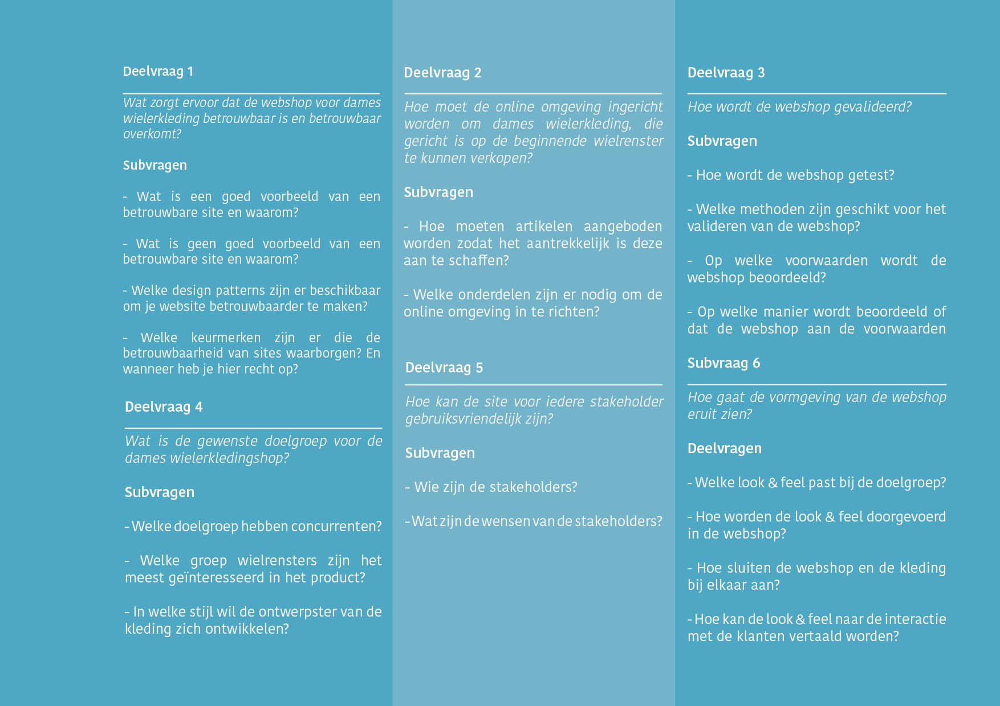
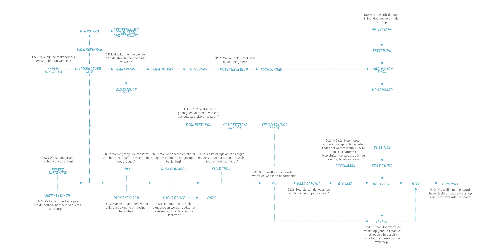

# De oriëntatie

## De Design Challenge

Om tot een ontwerpvraag te komen, is gebruik gemaakt van [een template](https://kpmelzakkers.gitbook.io/cyclismo-product-biografie/project/design-challenge/worksheet-design-challenge) van “The Field Guide to Human Centered Design”.

Vanuit de methode is de volgende Design Challenge geformuleerd:

_“Hoe kan online wielerkleding aangeboden worden aan \(beginnende\) wielrensters zodat zij geen zorgen hebben over hun wielerkleding en daardoor met meer zelfverzekerdheid op de fiets stappen, waarbij een budget van €150,- per wielerseizoen als maatstaf gehouden wordt?”_  

### De deelvragen

Om de Design Challenge te kunnen beantwoorden, is deze opgedeeld in 6 deelvragen, zie figuur 1. Deze deelvragen kunnen beantwoord worden door middel van verschillende subvragen. Door gebruik te maken van deze subvragen, kunnen belangrijke elementen niet over het hoofd gezien worden en kan er een planning worden gemaakt. De subvragen bestaan uit vragen die gaan over verkenning, ideatie en testen van het ontwerp.


De resultaten van de onderzoeks- en ontwerpfase worden op chronologische volgorde weergegeven en niet op basis van deze sub- en deelvragen.



Tijdens het onderzoeken van de deelvragen ben ik er achter gekomen dat een aantal deelvragen dubbele informatie bevatten. Deze conclusie is getrokken omdat er op verschillende vragen dezelfde antwoorden gegeven konden worden. Het opnieuw onderzoeken van de deelvragen zou mij meer tijd kosten en te weinig inzichten geven. Daarom heb ik besloten een aantal subvragen te schrappen en een aantal aan te passen. Het Programma van Eisen is niet aangepast, omdat de antwoorden die ik nodig had, daarin gegeven zijn door middel van de overgebleven antwoorden. Zo kreeg ik een beter overzicht waar ik welke informatie vandaan kon halen. 


## Het product

### De focus

De focus van het project ligt op de wensen van de gebruiker/doelgroep. De producten en de online shop moeten bij alle behoeften van de doelgroep aansluiten. Onderzoek doen naar de doelgroep is daarom erg belangrijk. 

De focus voor het ontwerp richt zich op het geven van gevraagd en ongevraagd advies aan de klant tijdens de aankoopt. Daarbij houdt de site rekening met het budget van de klant.

### De doelstelling

De site heeft als doelstelling om dames wielerkleding te verkopen door een gemakkelijke aanschaf en daarbij het budget van €150,- per wielerseizoen niet te overschrijden. Hierbij is het streven om de klant duidelijk te informeren wat de producten bieden en waar zij tijdens de aanschaf op moeten letten, door middel van vakkundig advies. 

### De visie

[De uiteindelijke oplossing](https://kpmelzakkers.gitbook.io/cyclismo-product-biografie/deelvraag-1/deelvraag-2-or-hoe-moet-de-online-omgeving-ingericht-worden/subvraag-1-or-hoe-moeten-artikelen-aangeboden-worden-zodat-het-aantrekkelijk-is-deze-aan-te-schaffen) is in de vorm van een webshop. Hierop is de ontwikkelde dames wielerkleding te bekijken, is meer informatie te vinden en kan de klant de kleding bestellen. Hierbij zal zij begeleidt worden in de aankoop en heeft zij de gemakkelijke optie om onder een budget van €150,- te blijven. Hiervoor zijn de [Usability regels](https://kpmelzakkers.gitbook.io/cyclismo-product-biografie/deelvraag-1/deelvraag-5-or-hoe-kan-de-site-voor-iedere-stakeholder-gebruiksvriendelijk-zijn/subvraag-2-or-hoe-kunnen-de-wensen-van-de-stakeholders-vervuld-worden) nageleefd. Daarnaast is de webshop gemakkelijk in gebruik; de klant moet kleding kunnen sorteren en filtreren naar haar keuze.

De webshop zal een look & feel hebben die aansluit bij de doelgroep en de kleding. Hierbij is de visie van het merk dat vrouwen zich goed moeten voelen en zelfverzekerd op de fiets moeten kunnen stappen. Uit eigen ervaring is bekend dat er weinig merken zijn die echt aansluiten bij onze wensen en aan de wensen van onze doelgroep. Cyclismo moet een merk zijn waar vrouwen zich fijn in voelen, maar welke ook betaalbaar is. Het merk moet daarnaast laagdrempelig zijn. De uitdaging is dat de klant zich verbonden voelt met het merk en erop kan vertrouwen, door advies te kunnen vragen en daarnaast goede kwaliteit kleding te ontvangen.

## De opbouw van het project

Het project is gericht op het onderzoek en de conceptontwikkeling. In figuur 2 worden bij alle subvragen de methodes weergegeven die gebruikt worden voor het vinden van de antwoorden. Daarbij is te zien dat methodes elkaar opvolgen en informatie uit het ene onderzoek wordt gebruikt in het andere. 

In de beginfase zijn de kans en de bijbehorende stakeholders onderzocht om zo het concept aan te laten sluiten bij de doelgroep. 

Toen de doelgroep en de kans in kaart gebracht waren, is het concept uitgewerkt. Hiervoor zijn verschillende oplossingen gezocht voor de kansen die er lagen. Door middel van feedback van docenten, medestudenten en experts is de meest passende oplossing gekozen. Deze gekozen oplossing is uitgewerkt tot een paper prototype. Het prototype is gebruikt tijdens het testen van het concept en het itereren van verschillende mogelijkheden.

Nadat het hele concept getest was, ben ik gaan kijken naar de Feel van de webshop. De ontwikkeling van de Feel is het hele project lang in gang geweest, maar is in de laatste fase concreet gemaakt en omgezet in een Hifi prototype. 

