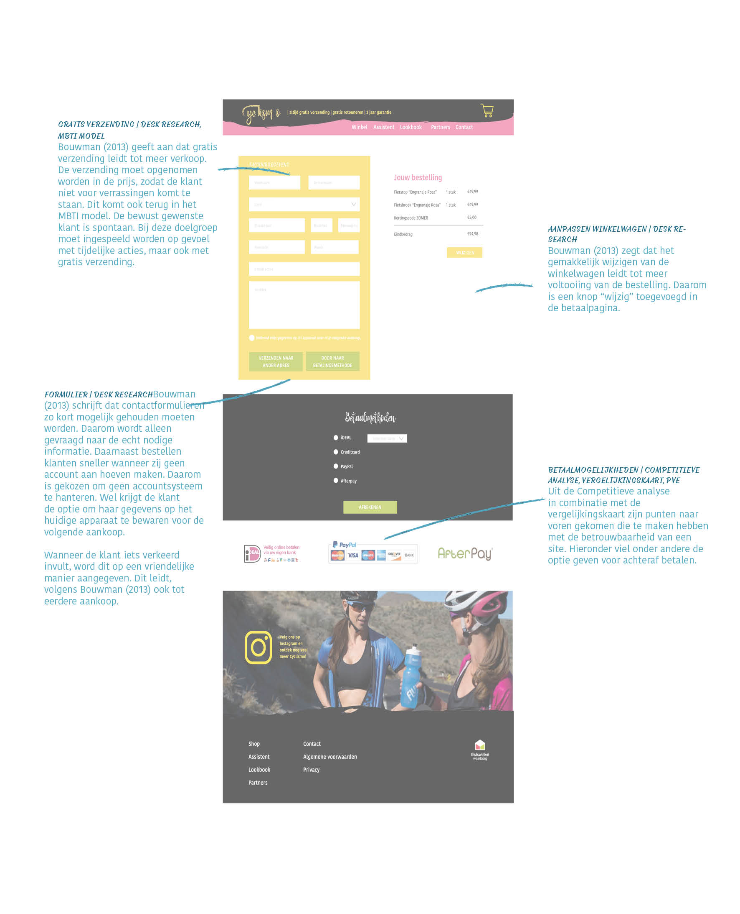

# Uitwerking aankooppagina

#### Links naar onderzoeksmethoden

* [Gratis verzending \(Desk Research\)](https://kpmelzakkers.gitbook.io/cyclismo-product-biografie/deelvraag-1/deelvraag-2-or-hoe-moet-de-online-omgeving-ingericht-worden/subvraag-1-or-hoe-moeten-artikelen-aangeboden-worden-zodat-het-aantrekkelijk-is-deze-aan-te-schaffen)
* [Gratis verzending \(MBTI model, zie kop bijlage\)](https://kpmelzakkers.gitbook.io/cyclismo-product-biografie/deelvraag-1/deelvraag-5-or-hoe-kan-de-site-voor-iedere-stakeholder-gebruiksvriendelijk-zijn/subvraag-1-or-wie-zijn-de-stakeholders-en-wat-zijn-hun-wensen/vragenlijst)
* [Gratis verzending \(Persona\)](https://kpmelzakkers.gitbook.io/cyclismo-product-biografie/deelvraag-1/deelvraag-5-or-hoe-kan-de-site-voor-iedere-stakeholder-gebruiksvriendelijk-zijn/subvraag-1-or-wie-zijn-de-stakeholders-en-wat-zijn-hun-wensen/personas)
* [Aanpassingen winkelwagen \(Desk Research\)](https://kpmelzakkers.gitbook.io/cyclismo-product-biografie/deelvraag-1/deelvraag-2-or-hoe-moet-de-online-omgeving-ingericht-worden/subvraag-1-or-hoe-moeten-artikelen-aangeboden-worden-zodat-het-aantrekkelijk-is-deze-aan-te-schaffen)
* [Formulier \(Desk Research\)](https://kpmelzakkers.gitbook.io/cyclismo-product-biografie/deelvraag-1/deelvraag-2-or-hoe-moet-de-online-omgeving-ingericht-worden/subvraag-1-or-hoe-moeten-artikelen-aangeboden-worden-zodat-het-aantrekkelijk-is-deze-aan-te-schaffen)
* [Betaalmogelijkheden \(Competitieve analyse\)](https://kpmelzakkers.gitbook.io/cyclismo-product-biografie/deelvraag-1/deelvraag-1-or-wat-zorgt-ervoor-dat-de-webshop-voor-dames-wielerkleding-betrouwbaar-is-en-overkomt/subvraag-1-en-2-or-wat-is-een-geen-goed-voorbeeld-van-een-betrouwbare-site-en-waarom/competitieve-analyse)
* [Betaalmogelijkheden \(Vergelijkingskaart\)](https://kpmelzakkers.gitbook.io/cyclismo-product-biografie/deelvraag-1/deelvraag-1-or-wat-zorgt-ervoor-dat-de-webshop-voor-dames-wielerkleding-betrouwbaar-is-en-overkomt/subvraag-1-en-2-or-wat-is-een-geen-goed-voorbeeld-van-een-betrouwbare-site-en-waarom/vergelijkingskaart)
* Betaalmogelijkheden \(PvE\)

Link naar [Uitwerking pagina](https://kpmelzakkers.gitbook.io/cyclismo-product-biografie/deelvraag-1/deelvraag-6-or-hoe-gaat-de-vormgeving-van-de-webshop-eruit-zien/subvraag-3-or-hoe-sluiten-de-webshop-en-de-kleding-bij-elkaar-aan-1/uitwerking-aankooppagina)

