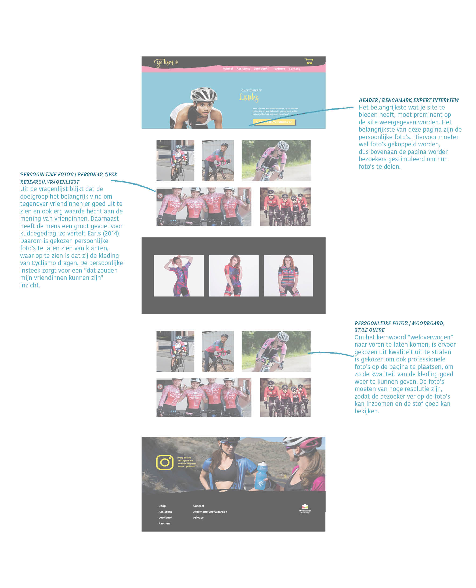

# Uitwerking lookbook

#### Links naar onderzoeksmethoden

* [Header \(Benchmark\)](https://kpmelzakkers.gitbook.io/cyclismo-product-biografie/deelvraag-1/deelvraag-6-or-hoe-gaat-de-vormgeving-van-de-webshop-eruit-zien/subvraag-3-or-hoe-sluiten-de-webshop-en-de-kleding-bij-elkaar-aan-1/subvraag-3-or-hoe-sluiten-de-webshop-en-de-kleding-bij-elkaar-aan)
* [Header \(Expert interview\)](https://kpmelzakkers.gitbook.io/cyclismo-product-biografie/deelvraag-1/deelvraag-5-or-hoe-kan-de-site-voor-iedere-stakeholder-gebruiksvriendelijk-zijn/subvraag-1-or-wie-zijn-de-stakeholders-en-wat-zijn-hun-wensen/expert-interview)
* [Meningen \(Empathy Map\)](https://kpmelzakkers.gitbook.io/cyclismo-product-biografie/deelvraag-1/deelvraag-5-or-hoe-kan-de-site-voor-iedere-stakeholder-gebruiksvriendelijk-zijn/subvraag-1-or-wie-zijn-de-stakeholders-en-wat-zijn-hun-wensen/empathy-map)
* [Kuddegedrag \(Desk Research\)](https://kpmelzakkers.gitbook.io/cyclismo-product-biografie/deelvraag-1/deelvraag-5-or-hoe-kan-de-site-voor-iedere-stakeholder-gebruiksvriendelijk-zijn/subvraag-1-or-wie-zijn-de-stakeholders-en-wat-zijn-hun-wensen/desk-research)
* [Persoonlijke foto's \(Moodboard\)](https://kpmelzakkers.gitbook.io/cyclismo-product-biografie/deelvraag-1/deelvraag-6-or-hoe-gaat-de-vormgeving-van-de-webshop-eruit-zien/subvraag-1-or-welke-look-and-feel-past-bij-de-doelgroep/moodboard)
* [Persoonlijke foto's \(Style Guide\)](https://kpmelzakkers.gitbook.io/cyclismo-product-biografie/deelvraag-1/deelvraag-6-or-hoe-gaat-de-vormgeving-van-de-webshop-eruit-zien/subvraag-2-or-hoe-wordt-de-look-and-feel-doorgevoerd-in-de-webshop/style-tile)

Link naar [Uitwerking pagina](https://kpmelzakkers.gitbook.io/cyclismo-product-biografie/deelvraag-1/deelvraag-6-or-hoe-gaat-de-vormgeving-van-de-webshop-eruit-zien/subvraag-3-or-hoe-sluiten-de-webshop-en-de-kleding-bij-elkaar-aan-1/uitwerking-lookbook)

