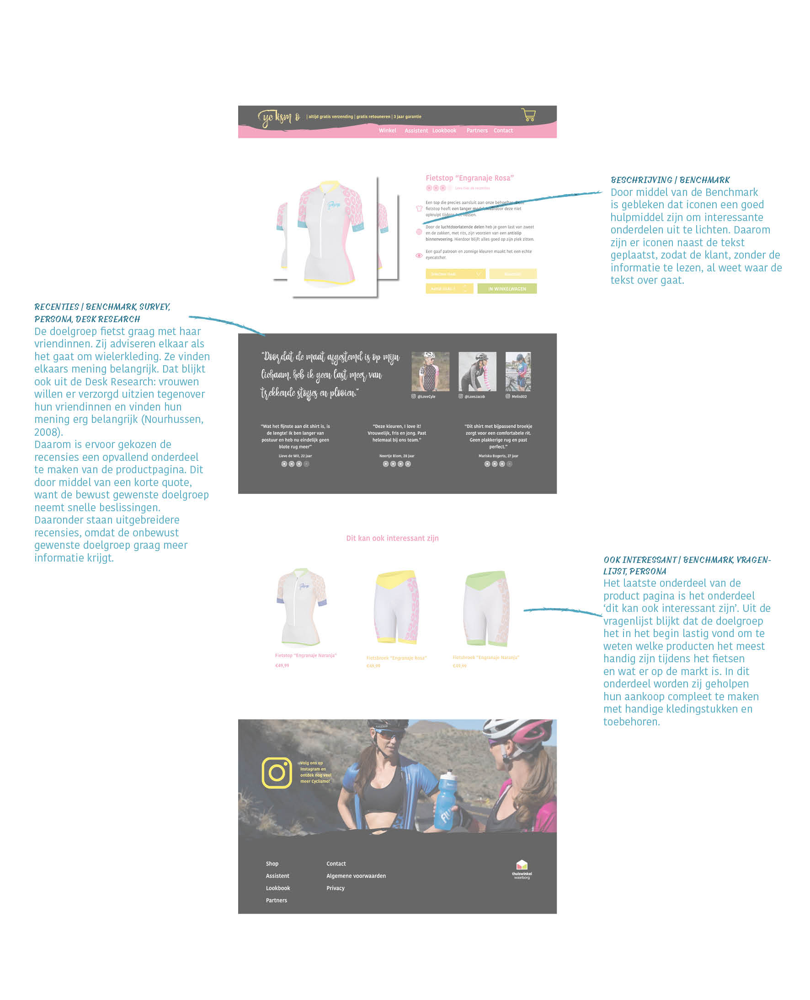

# Uitwerking productpagina

#### Links naar onderzoeksmethoden 

* [Iconen \(Benchmark\)](https://kpmelzakkers.gitbook.io/cyclismo-product-biografie/deelvraag-1/deelvraag-6-or-hoe-gaat-de-vormgeving-van-de-webshop-eruit-zien/subvraag-3-or-hoe-sluiten-de-webshop-en-de-kleding-bij-elkaar-aan-1/subvraag-3-or-hoe-sluiten-de-webshop-en-de-kleding-bij-elkaar-aan)
* [Meningen vriendinnen \(Persona\)](https://kpmelzakkers.gitbook.io/cyclismo-product-biografie/deelvraag-1/deelvraag-5-or-hoe-kan-de-site-voor-iedere-stakeholder-gebruiksvriendelijk-zijn/subvraag-1-or-wie-zijn-de-stakeholders-en-wat-zijn-hun-wensen/personas)
* [Verzorging \(Desk Research\)](https://kpmelzakkers.gitbook.io/cyclismo-product-biografie/deelvraag-1/deelvraag-5-or-hoe-kan-de-site-voor-iedere-stakeholder-gebruiksvriendelijk-zijn/subvraag-1-or-wie-zijn-de-stakeholders-en-wat-zijn-hun-wensen/desk-research)
* [Ook interessant \(Benchmark\)](https://kpmelzakkers.gitbook.io/cyclismo-product-biografie/deelvraag-1/deelvraag-6-or-hoe-gaat-de-vormgeving-van-de-webshop-eruit-zien/subvraag-3-or-hoe-sluiten-de-webshop-en-de-kleding-bij-elkaar-aan-1/subvraag-3-or-hoe-sluiten-de-webshop-en-de-kleding-bij-elkaar-aan)
* [Ook interessant \(Vragenlijst\)](https://kpmelzakkers.gitbook.io/cyclismo-product-biografie/deelvraag-1/deelvraag-5-or-hoe-kan-de-site-voor-iedere-stakeholder-gebruiksvriendelijk-zijn/subvraag-1-or-wie-zijn-de-stakeholders-en-wat-zijn-hun-wensen/vragenlijst)

Link naar [Uitwerking pagina](https://kpmelzakkers.gitbook.io/cyclismo-product-biografie/deelvraag-1/deelvraag-6-or-hoe-gaat-de-vormgeving-van-de-webshop-eruit-zien/subvraag-3-or-hoe-sluiten-de-webshop-en-de-kleding-bij-elkaar-aan-1/uitwerking-productpagina)

