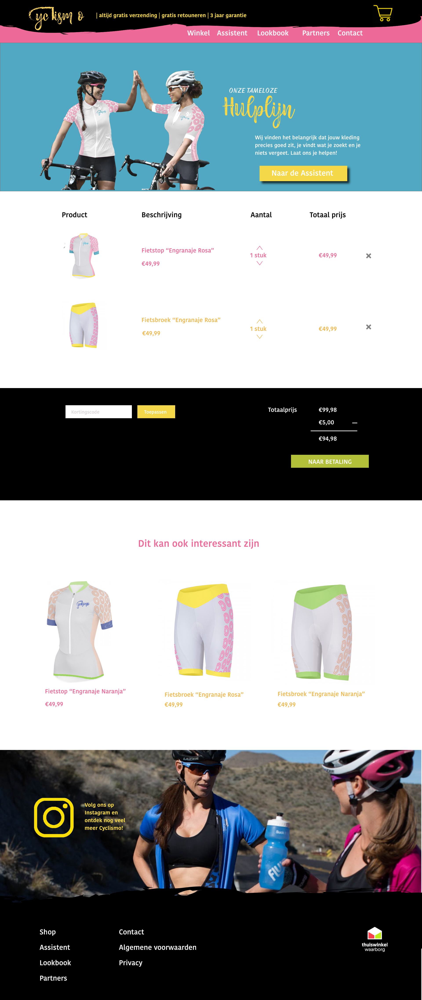
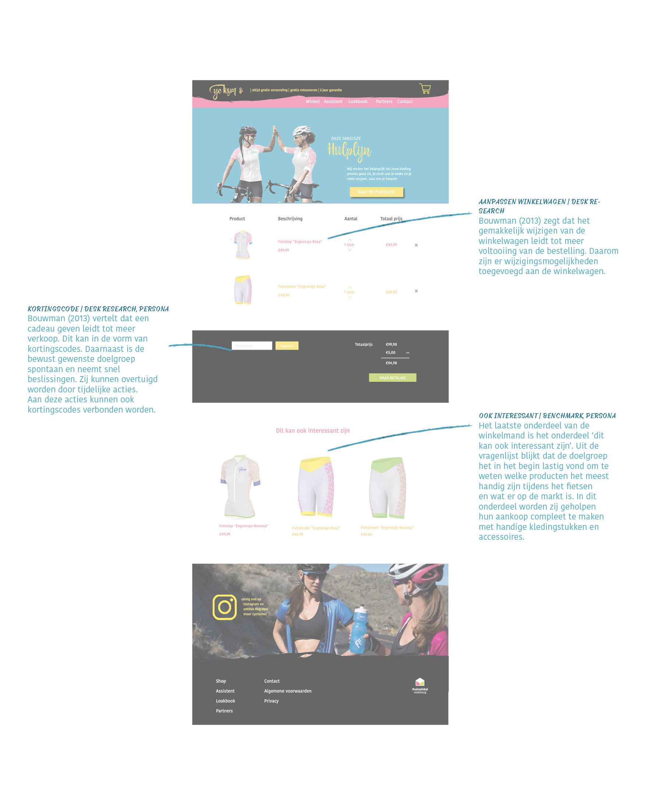

# Uitwerking winkelwagen

#### Links naar onderzoeksmethoden

* [Wijzigen \(Desk Research\)](https://kpmelzakkers.gitbook.io/cyclismo-product-biografie/deelvraag-1/deelvraag-2-or-hoe-moet-de-online-omgeving-ingericht-worden/subvraag-1-or-hoe-moeten-artikelen-aangeboden-worden-zodat-het-aantrekkelijk-is-deze-aan-te-schaffen)
* [Kortingscode \(Desk Research\)](https://kpmelzakkers.gitbook.io/cyclismo-product-biografie/deelvraag-1/deelvraag-2-or-hoe-moet-de-online-omgeving-ingericht-worden/subvraag-1-or-hoe-moeten-artikelen-aangeboden-worden-zodat-het-aantrekkelijk-is-deze-aan-te-schaffen)
* [Kortingscode \(Persona\)](https://kpmelzakkers.gitbook.io/cyclismo-product-biografie/deelvraag-1/deelvraag-5-or-hoe-kan-de-site-voor-iedere-stakeholder-gebruiksvriendelijk-zijn/subvraag-1-or-wie-zijn-de-stakeholders-en-wat-zijn-hun-wensen/personas)
* [Ook interessant \(Benchmark\)](https://kpmelzakkers.gitbook.io/cyclismo-product-biografie/deelvraag-1/deelvraag-6-or-hoe-gaat-de-vormgeving-van-de-webshop-eruit-zien/subvraag-3-or-hoe-sluiten-de-webshop-en-de-kleding-bij-elkaar-aan-1/subvraag-3-or-hoe-sluiten-de-webshop-en-de-kleding-bij-elkaar-aan)
* [Ook interessant \(Vragenlijst\)](https://kpmelzakkers.gitbook.io/cyclismo-product-biografie/deelvraag-1/deelvraag-5-or-hoe-kan-de-site-voor-iedere-stakeholder-gebruiksvriendelijk-zijn/subvraag-1-or-wie-zijn-de-stakeholders-en-wat-zijn-hun-wensen/vragenlijst)

Link naar [Uitwerking pagina](https://kpmelzakkers.gitbook.io/cyclismo-product-biografie/deelvraag-1/deelvraag-6-or-hoe-gaat-de-vormgeving-van-de-webshop-eruit-zien/subvraag-3-or-hoe-sluiten-de-webshop-en-de-kleding-bij-elkaar-aan-1/uitwerking-winkelwagen)

