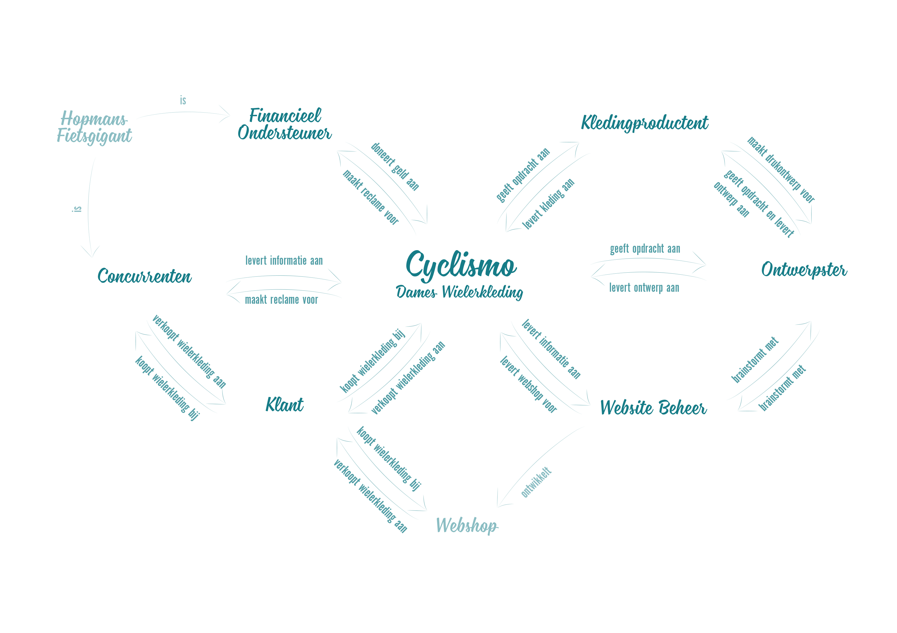

# De onderzoeksfase \| De stakeholders

De webshop moet voldoen aan alle wensen van alle stakeholders. Hiervoor is een stakeholder onderzoek gedaan door middel van een expert interview en een survey. De informatie die hier uit is gekomen, is visueel weergegeven in een stakeholder map, empathy map en persona’s. 


Tijdens het Stakeholder onderzoek is voor mij het project pas echt duidelijk geworden, omdat ik een beeld kreeg voor wie ik het project aan het draaien was. Ik heb geen opdrachtgever, dat ben ik zelf, dus op dit punt kwam er meer houvast aan het project.


## In kaart brengen van de Stakeholders

### Expert interview

Door middel van de [expert interviews](https://kpmelzakkers.gitbook.io/cyclismo-product-biografie/deelvraag-1/deelvraag-5-or-hoe-kan-de-site-voor-iedere-stakeholder-gebruiksvriendelijk-zijn/subvraag-1-or-wie-zijn-de-stakeholders-en-wat-zijn-hun-wensen/expert-interview)  en het vergelijken met de eigen onderneming, zijn de stakeholders vastgesteld. Het zoeken van de stakeholders is gedaan, zodat er een beeld ontstaat met welke personen en groepen rekening gehouden moet worden tijdens het ontwerpproces. De stakeholders zijn:

* Bewust gewenste klant
* Onbewust gewenste klant
* Website ontwikkelaar
* Financieel ondersteuner
* Kleding producten
* Ontwerpster

> **De gevonden stakeholders zijn verwerkt in een stakeholder map.**

### Stakeholder Map

Alle stakeholders zijn weergegeven in [een stakeholder map](https://kpmelzakkers.gitbook.io/cyclismo-product-biografie/deelvraag-1/deelvraag-5-or-hoe-kan-de-site-voor-iedere-stakeholder-gebruiksvriendelijk-zijn/subvraag-1-or-wie-zijn-de-stakeholders-en-wat-zijn-hun-wensen/stakeholdermap). Hierin zijn ook de onderlinge relaties en de relatie met de eigen onderneming 'Cyclismo' weergegeven, zie figuur 3.

> **De Stakeholder Map is gebruikt voor het in beeld brengen van de stakeholders en het bepalen van de stakeholders tegenover elkaar. De Stakeholders zijn verwerkt in het** [**Plan van Eisen**](https://kpmelzakkers.gitbook.io/cyclismo-product-biografie/deelvraag-1/deelvraag-3-or-hoe-wordt-de-webshop-gevalideerd/subvraag-3-or-op-welke-voorwaarden-wordt-de-webshop-beoordeeld) **en verder uitgewerkt in de volgende paragrafen.**

### \*\*\*\*

