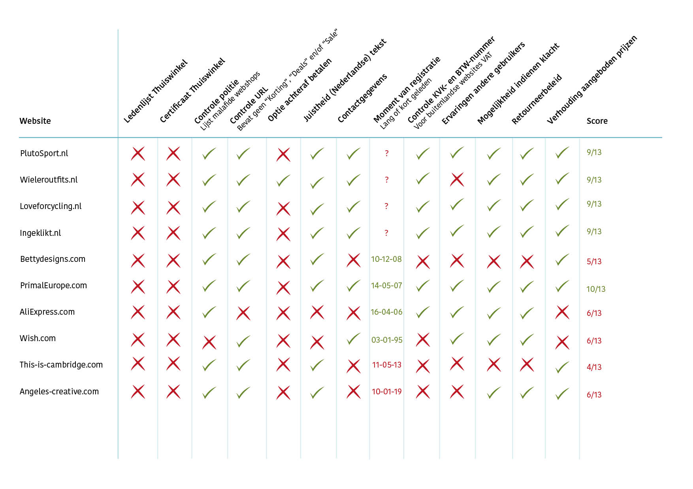

# De concurrenten

Om een beeld te krijgen van de concurrent en te onderzoeken waar Cyclismo in uit kan blinken, is een competitieve analyse gedaan.

## Competitieve analyse 

### Betrouwbare/onbetrouwbare sites

Door [een literatuur studie](https://kpmelzakkers.gitbook.io/cyclismo-product-biografie/deelvraag-1/deelvraag-1-or-wat-zorgt-ervoor-dat-de-webshop-voor-dames-wielerkleding-betrouwbaar-is-en-overkomt/subvraag-1-en-2-or-wat-is-een-geen-goed-voorbeeld-van-een-betrouwbare-site-en-waarom/literatuur-studie) zijn punten opgesteld waar websites op beoordeeld worden of zij een betrouwbare of onbetrouwbare online omgeving zijn. De resultaten van de competitieve analyse zijn uiteengezet in Vergelijkingskaart, zie figuur 12.


Er is gekozen om onderzoek te doen naar betrouwbare websites, uit eigen ervaringen,  korte interviews met de doelgroep en de survey. Hieruit kwam naar voren dat sites met goedkope dames wielerkleding er onbetrouwbaar uitzien of zijn.



Van tevoren vond ik het lastig om in te schatten waar een betrouwbare site aan moet voldoen. Ik was bekend met de keurmerken die bedrijven op hun sites kunnen plaatsen, maar ik was erg benieuwd naar andere methodes. 


> **De USP's die voortkomen uit de Competitieve analyse zijn omgezet in eisen en opgenomen in het** [**Programma van Eisen**](https://cyclismo.gitbook.io/cyclismo-design-rationale/de-onderzoeksfase/het-contextonderzoek/het-resultaat-contextonderzoek)**.**

 

