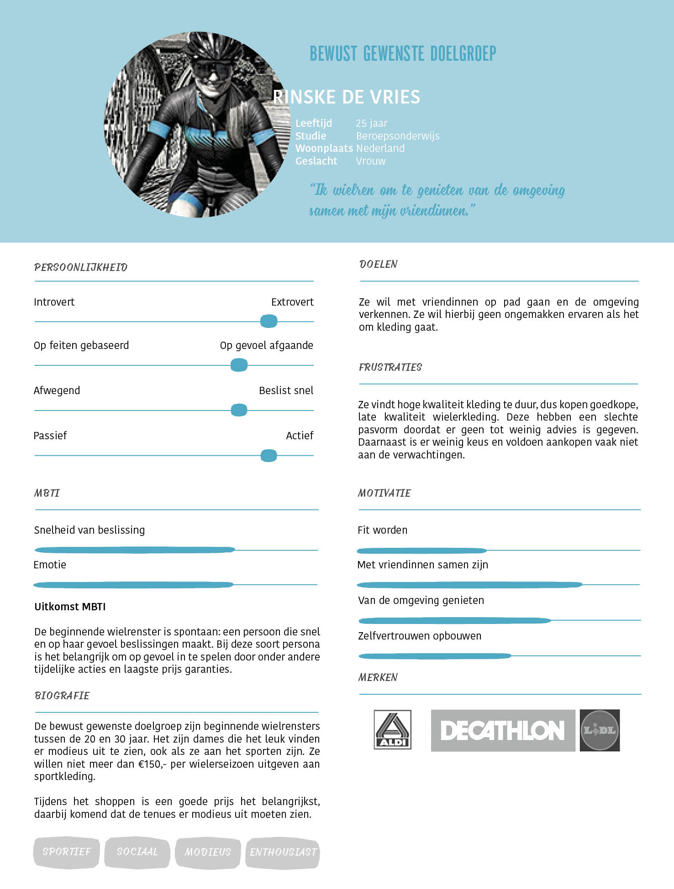
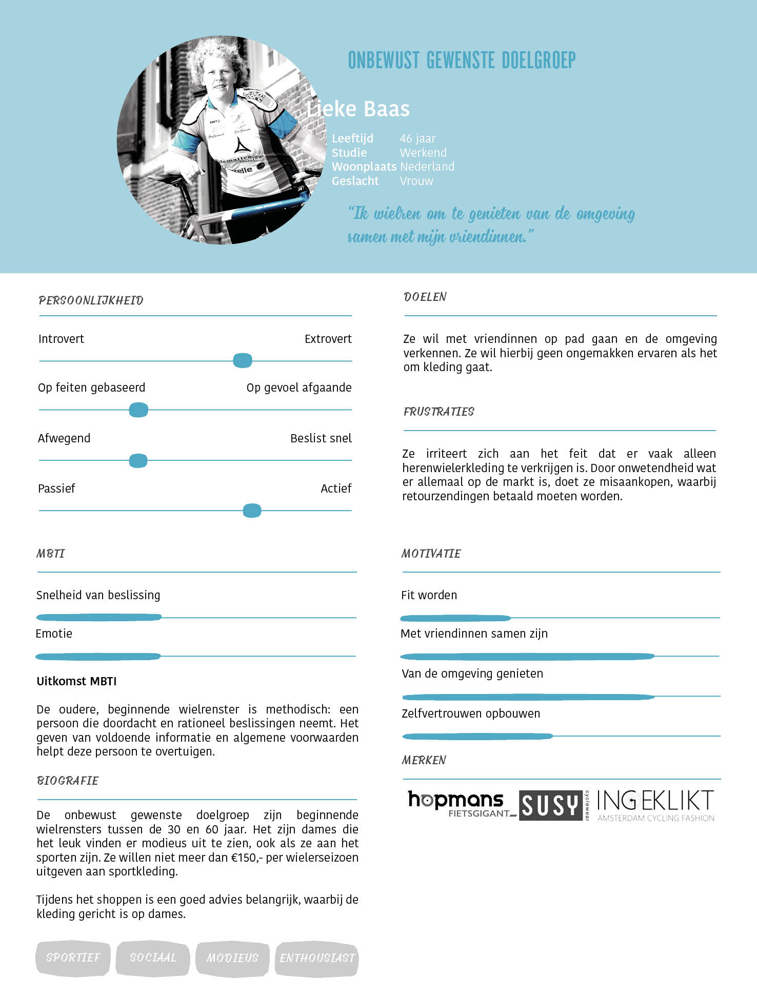

# De doelgroep \(klant\)

Om een beeld te krijgen van de bewust en onbewust gewenste klanten, is gebruik gemaakt van [een vragenlijst](https://kpmelzakkers.gitbook.io/cyclismo-product-biografie/deelvraag-1/deelvraag-5-or-hoe-kan-de-site-voor-iedere-stakeholder-gebruiksvriendelijk-zijn/subvraag-1-or-wie-zijn-de-stakeholders-en-wat-zijn-hun-wensen/vragenlijst). Dit is gedaan om vooral kwantitatieve informatie uit een grote groep van de doelgroep te verzamelen.

De resultaten van de vragenlijst zijn onderverdeeld in 3 groepen:

* Bewust gewenste doelgroep: dames die \(beginnend\) wielrenster zijn, in de leeftijdscategorie 16 - 30 jaar
* Onbewust gewenste doelgroep: dames die \(beginnend\) wielrenster zijn, in de leeftijdscategorie 30 - 60 jaar
* Heren die \(beginnend\) wielrenner zijn

Er is gekozen de vragenlijst ook onder heren te verspreiden, omdat zij wielerkleding aanschaffen en hierbij problemen en voordelen ervaren.

De resultaten van de vragenlijst is te lezen in figuur 7.

> **Om een beeld te krijgen van de doelgroep, zijn de resultaten uit de vragenlijst omgezet in een Empathy Map en Persona's.**

## **Uitwerking doelgroep**

### Persona's

De persona's representeren de gebruiker in discussies over het design. De persona's zijn gebaseerd op de vragenlijst die verspreid is onder de doelgroep.

Van de bewust gewenste doelgroep, onbewust gewenste doelgroep van 20 tot 30 jaar en de onbewust gewenste doelgroep van 30 tot 60 jaar zijn persona's zijn opgesteld, zie figuur 8, 9 en 10.















> **De persona's zijn gebruikt voor het representeren van de gebruiker bij ontwerpen en binnen discussies.**

### **Empathy Map**

In een Empathy Map komt de data uit de vragenlijst bij elkaar in een visueel overzicht. Er is in weergegeven wat de doelgroep hoort, doet, zegt en voelt. Hierbij komen alleen de belangrijkste punten naar voren. Het doel is om nieuwe inzichten te krijgen en een overzicht te krijgen van de gevonden informatie.

De Empathy Map is weergegeven in figuur 11.

> **De empathy map is gebruikt voor het representeren van de gebruiker bij ontwerpen en binnen discussies.**

### \*\*\*\*

