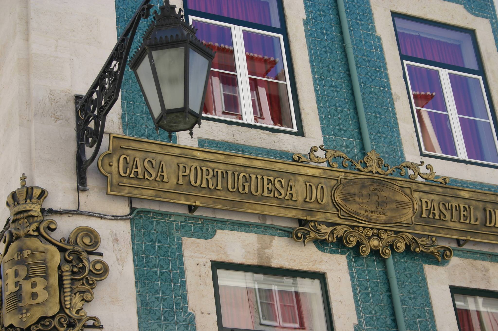

# De kledingproducent

Cyclismo heeft een eigen ontwerpster, waardoor wij alleen een kledingproducent nodig hebben en geen ontwerpbureau. Dit scheelt veel in de kosten, maar we vinden het belangrijk dat de kleding eerlijk wordt geproduceerd. Om dit te bereiken is een fabriek in Portugal aangeschreven. In deze fabriek wordt de kleding van Juffrouw Jansen \(stageplaats propedeuse jaar\) ook geproduceerd. Uit ervaring van Juffrouw Jansen weten we dat dit een betrouwbare fabriek is, waar hoge kwaliteit kleding wordt geleverd. 

De fabriek, Barlope Empresa de Confeccões, is gestationeerd in Barcelos, een paar kilometer boven Porto. De ontwerpster heeft de contacten met de fabriek verzorgd. Om een beeld te krijgen met welk bedrijf wij te maken hadden, hebben wij een bezoek gebracht aan deze fabriek. Wat ons opviel waren de lichte, goed verzorgde werkplaatsen en het enthousiasme waarmee wij ontvangen werden. Voor de ontwerpster was dit een erg leerzaam bezoek, voor mij een interessante kijk achter de schermen.

In de fabriek mochten geen foto's gemaakt worden in verband met de privacy van de medewerkers. 

