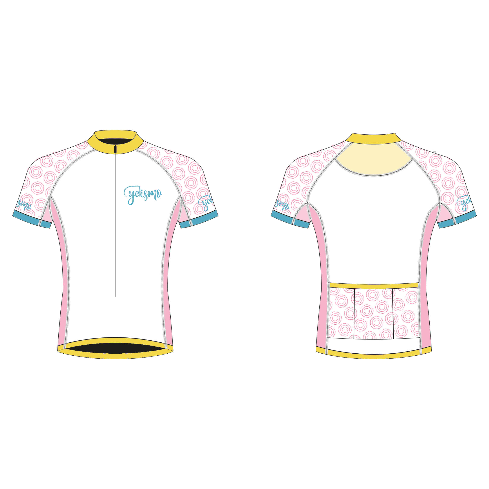

# Kledingontwerp

Samen met de ontwerpster is de kleding ontworpen. Dit ontwerpproces verliep tegelijk met de ontwerpfase van de site. Hierdoor konden in beide ontwerpen rekening gehouden worden met het andere ontwerp.

Er is gekozen eerst een compleet tenue te ontwikkelen: een shirt en een korte broek. Hier vanuit gaan we de collectie verder uitbreiden. In figuur 16a en 16b is het ontwerp van het eerste tenue weergegeven.

#### De aanpak

Voor het ontwikkelen van het tenue zijn eerst verschillende schetsen gemaakt door de ontwerpster, zoals figuur 4. Palmer \(2007\) vertelt in het boek "Research and Design" \(Seivewright, 2007\) dat zij geïnspireerd raakt door alles om haar heen. Dat is meegenomen in het ontwerp. Dit is terug te zien in het [moodboard](https://cyclismo.gitbook.io/cyclismo-design-rationale/de-onderzoeksfase/het-ontwerponderzoek), wat naast het boek, [de Style Tile en Style](https://cyclismo.gitbook.io/cyclismo-design-rationale/de-onderzoeksfase/het-ontwerponderzoek) Gids als leidraad heeft gediend.

Uit het moodboard heeft Floor de kleuren bepaald. Lichte, volle kleuren zijn toegepast op de ontwerpen. Daarnaast bleek uit het moodboard en de focus groep dat de doelgroep een voorkeur heeft voor [geometrische vormen](https://kpmelzakkers.gitbook.io/cyclismo-product-biografie/deelvraag-1/deelvraag-6-or-hoe-gaat-de-vormgeving-van-de-webshop-eruit-zien/subvraag-1-or-welke-look-and-feel-past-bij-de-doelgroep/focus-groep). Geïnspireerd door onze omgeving, in dit geval onze racefiets en de omgeving waarin wij graag fietsen, zijn verschillende patronen ontworpen, zie figuur 5.

De getekende ontwerpen zijn samengevoegd met de patronen door middel van Illustrator. Hier zijn geen iteraties gemaakt, omdat wij direct wisten wat we wilden. Dit door het vooronderzoek, moodboard en Style Tyle en Gids. Het gekozen ontwerp is ook uitgewerkt in Photoshop, zodat een duidelijk beeld gemaakt werd van het uiteindelijke resultaat, zie figuur 6a en 6b.

Nadat de ontwerpen uitgewerkt waren, zijn deze opgestuurd naar de kledingproducent. Het contact met de producent is via Floor verlopen, zodat ik mezelf kon richten op het project. Samen met de producent heeft Floor de keuze gemaakt voor de beste stoffen \(Neopreen en Polyester\). Hierbij is het budget van €150,- in de gaten gehouden. De keuze om ook Polyester te gebruiken is gemaakt om binnen het budget te blijven. 

De keuzes voor de stoffen heb ik aan Floor overgelaten, omdat zij door haar opleiding daar veel kennis over bezit. Vervolgens is de opdracht aan de kledingproducent overgedragen.

