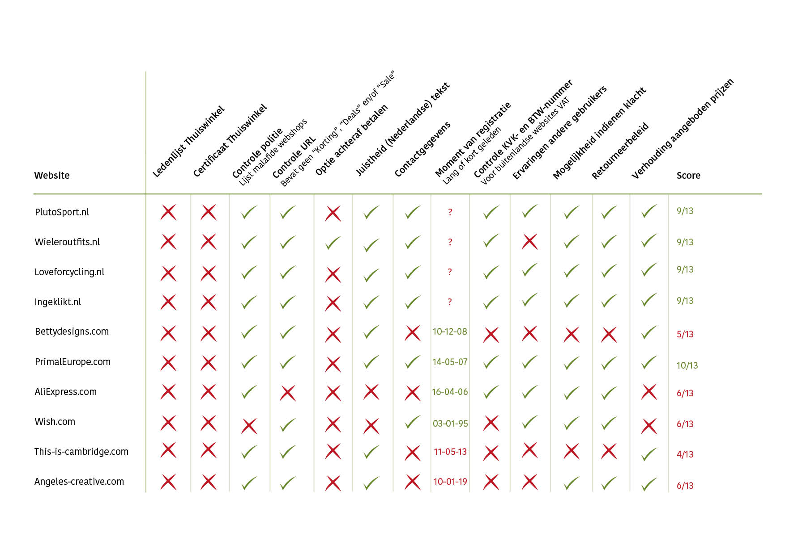

# Vergelijkingskaart



De uitkomsten zijn opgenomen in figuur 1. Hierin zijn ook de scores per webshop opgenomen. De webshop die het beste naar voren komt is [PrimalEurope.com](http://PrimalEurope.com) met een score van 10/13, gevolgd door Ingeklikt, Loveforcycling, Wieleroutfits en PluroSport, allen met een score van 9/10. 

Het is opvallend dat alle webshops geen lid zijn van het Thuiswinkel keurmerk. Daarnaast is er maar 1 webshop die achteraf betalen aanbiedt.

> **Als USP's \(User Selling Points\) wordt meegenomen: lid zijn van het Thuiswinkel keurmerk en achteraf betalen aanbieden. Deze punten worden opgenomen in het Programma van Eisen.**



