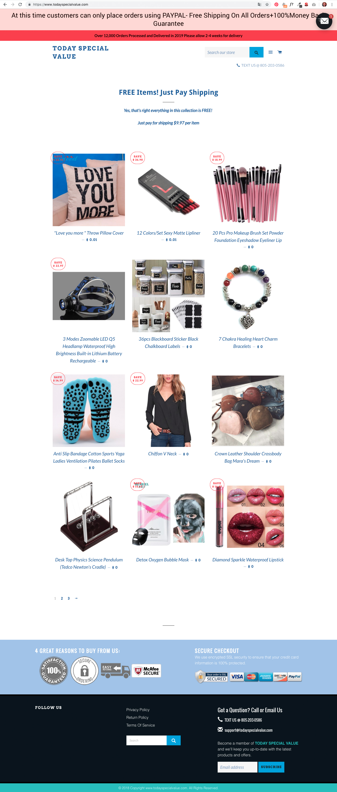
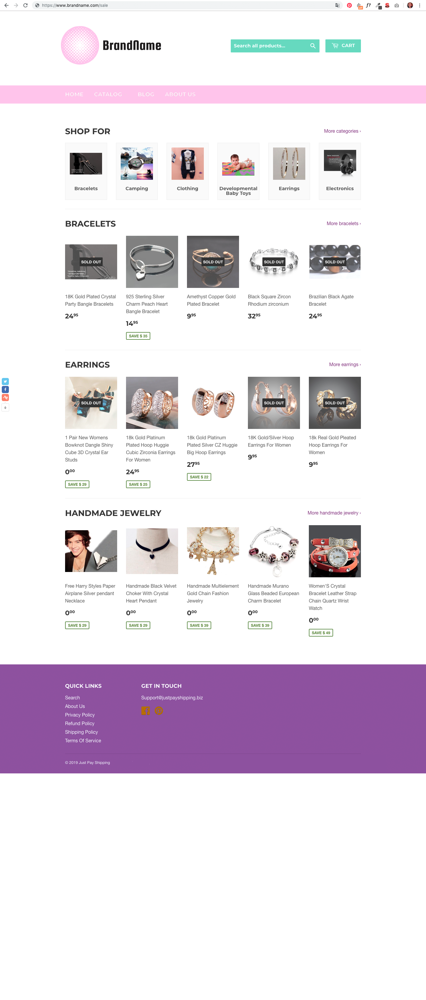

# Subvraag 3 \| Welke designkeuzes zorgen ervoor dat de klant een site wel/niet betrouwbaar vindt?

Om er achter te komen wat de doelgroep betrouwbaar vind en wat niet, is een field trial uitgevoerd. Tijdens deze trial zijn er aan de deelnemers schermafbeeldingen van twee sites voorgelegd, zie afbeelding 1 en 2. Afbeelding 1 toont de website van [todayspecialvalue.com](http://todayspecialvalue.com), een site die door de site van de politie als ‘onbetrouwbaar’ aangegeven wordt. Afbeelding 2 toont een website met de naam BrandName. Dit is de site van [JustPayShipping.biz](http://JustPayShipping.biz), welke in Photoshop bewerkt is.

De deelnemers is de vraag gesteld welke van de sites onbetrouwbaar of nep waren en waar zij dit op baseerden.

Positief/betrouwbaar:

* TSV \| Certificaten in de footer zien er betrouwbaar uit.
* TSV \| Er is wel moeite in gestoken.

Negatief/onbetrouwbaar:

* TSV \| Staan geen prijzen bij de producten. 
* TSV \| De look & feel van de pagina zijn onverzorgd.
* BN \| Geen gegevens over het bedrijf
* TSV \| Lijkt op AliExpress
* TSV \| Je weet niet of de keurmerken onderaan de pagina echt zijn.

> **In het Programma van Eisen is toegevoegd: Certificaten/keurmerken geven een vertrouwd beeld, gegevens van het bedrijf moeten makkelijk vindbaar zijn en de pagina moet er verzorgd uitzien.**

