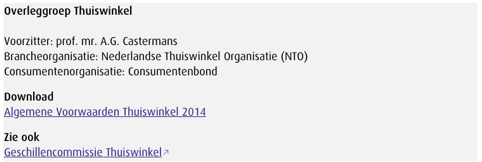

# Subvraag 4 \| Welke keurmerken zijn er die de betrouwbaarheid van sites waarborgen?

Om subvraag 4 te beantwoorden, is gebruik gemaakt van een Literatuur Studie.



Om erachter te komen welke keurmerken aangeven of een site een betrouwbare site is, is binnen de literatuur studie onderzoek gedaan naar keurmerken.

**Wat betekent het hebben van een keurmerk?**

Webwinkels met een keurmerk geven garantie over een bepaalde service. Leden van de keurmerken hanteren tweezijdige algemene voorwaarden. Dit zijn consumentenvoorwaarden die tot stand komen door overleg tussen branche- en consumentenorganisaties. Tijdens dit soort overleggen wordt een \(koop\)overeenkomst opgesteld tussen consument en ondernemer: de “kleine lettertjes”. De SER, Sociaal-Economische Raad leidt deze bijeenkomsten. In figuur 1 is het overzicht van Overleggroep Thuiswinkel te zien. In dit overzicht zijn de voorzitter, branche- en consumentenorganisatie te vinden. Daarnaast zijn de Algemene Voorwaarden Thuiswinkel 2014 te downloaden en is er een link naar de geschillencommissie toegevoegd.

  
De Algemene Voorwaarden zijn van toepassing op elk aanbod van de ondernemer en op elke tot stand gekomen overeenkomst tussen ondernemer en consument. Meer hierover onder “Algemene Voorwaarden”.

Naast dat keurmerken een garantie geven over een bepaalde service, kunnen consumenten ook naar een onafhankelijke geschillencommissie stappen wanneer ze een conflict hebben met een aangesloten webwinkel.

**Soorten keurmerken**

De consumentenbond schrijft de keurmerken [Thuiswinkel Waarborg](https://www.thuiswinkel.org/) en [Webshop Keurmerk](http://www.keurmerk.info/) voor. Daarnaast zijn er keurmerken zoals MkbOke, Webwinkelkeur, Thuiswinkel Keurmerk en Qshops Keurmerk, maar deze zijn niet aangesloten bij De Geschillencommissie en hebben geen algemene voorwaarden afgesproken met De Consumentenbond.

**Voordelen keurmerk voor de consument**

Voor de consument zijn er een aantal voordelen als ze bij een webshop met keurmerk kopen.

* Duidelijkheid kosten
  * De consument krijgt voor aankoop informatie over bijkomende kosten, zoals polis- of verzendkosten.
* Achteraf betalen
  * De consument krijgt de mogelijkheid om minimaal 50% van het aankoopbedrag achteraf te betalen.
* Bedenktijd
  * De consument heeft een bedenktijd van minimaal 14 dagen. Wanneer hij of zij van de aankoop afziet, worden alle kosten binnen maximaal 30 dagen teruggestort, met uitzondering van de kosten van een retourzending.
* Garantie via de webwinkel
  * De webwinkel mag de consument niet doorsturen maar moet zelf problemen rondom garantie zelf oplossen.
* Klachtenbemiddeling
  * Klachten die niet zelf opgelost kunnen worden, worden door het Keurmerk afgehandeld.
* Privacy
  * De webwinkel moet aangeven wat er gedaan wordt met de persoonlijke gegevens van de consument.

**Voordelen keurmerk voor de webshop**

Voor de webshop zijn er een aantal voordelen als ze een keurmerk hebben . 

* Vertrouwen
  * 93% van de consumenten herkent een keurmerklogo.
* Klantbeoordelingen
  * 80% van de consumenten kijkt naar klantbeoordelingen
* Voldoen aan de Wet
  * Jaarlijkse check op wetgeving, veiligheid en financieel stabiliteit.
  * Voldoen aan de nieuwe Privacywet \(AVG\).
  * Juridisch advies over \(consumenten\) wetgeving, klachten en geschillen.
* Hulp bij geschillen
  * Aangesloten bij de Onafhankelijke Geschillencommissie.

**Recht op een Keurmerk**

Een webshop kan zichzelf aanmelden voor een Keurmerk wanneer deze voldoet aan een aantal eisen.

Als een webshop het Webshop Keurmerk of Thuiswinkel Waarborg wil dragen, moet deze voldoen aan de volgende punten.

De Verantwoordelijke van de webshop 

* verklaart de Keurmerk-code van de Stichting Webshop Keurmerk/Stichting Thuiswinkel Waarborg na te leven.
* verklaart de Algemene Voorwaarden van de Stichting Webshop Keurmerk/Stichting Thuiswinkel Waarborg te hanteren.
* verklaart medewerking te verlenen aan de controle en eventuele verbetering van de site teneinde te voldoen aan de consumentenwetgeving en Keurmerk-code.
* verplicht zich de jaarlijkse contributie te voldoen.

**Algemene voorwaarden**

Voor de webshop is het van belang te voldoen aan de Algemene Voorwaarden Thuiswinkel. Hiervoor zij de Algemene Voorwaarden Thuiswinkel 2014 doorgenomen. De belangrijkste punten uit de AV zijn:

* Als de Algemene Voorwaarden online aangedragen wordt, moet deze op een duurzame gegevensdrager overgenomen kunnen worden \(Artikel 3 Toepasselijkheid\).
* Als een aanbod een beperkte geldigheidsduur heeft, wordt dit nadrukkelijk vermeld. \(Artikel 4 Het aanbod\)
* Het aanbod bevat een volledige en nauwkeurige beschrijving. \(Artikel 4 Het aanbod\)
* Elk aanbod bevat genoeg informatie dat het voor de consument duidelijk is wat de rechten en verplichtingen zijn. \(Artikel 4 Het aanbod\)
* De consument kan een overeenkomst met betrekking tot een product minimaal 14 dagen zonder opgave van reden opzeggen. De ondernemer mag wel naar de reden vragen, maar dit niet verplicht stellen. \(Artikel 6 Herroepingsrecht\)
* De ondernemer vergoedt alle betalingen van de consument, inclusief eventuele leveringskosten door de ondernemer in rekening gebracht voor het geretourneerde product. \(Artikel 9 Verplichtingen van de ondernemer bij herroeping\)
* Gedurende de in het aanbod vermelde geldigheidsduur worden de prijzen van de aangeboden producten en/of diensten niet verhoogd, behoudens prijswijzigingen als gevolg van veranderingen in btw-tarieven. \(Artikel 11 De prijs\)
* De ondernemer beschikt over een voldoende bekend gemaakte klachtenprocedure en behandelt de klacht overeenkomstig deze klachtenprocedure. \(Artikel 16 Klachtenregeling\)

> **De belangrijkste punten uit de Algemene Voorwaarden zijn meegenomen naar het Programma van Eisen.**



Quist, B. \(2019b, 30 april\). Keurmerken webwinkels. Geraadpleegd op 6 mei 2019, van https://www.consumentenbond.nl/online-kopen/keurmerken-webwinkels

Thuiswinkel.org. \(z.d.\). Voordelen lidmaatschap. Geraadpleegd op 6 mei 2019, van https://www.thuiswinkel.org/bedrijven/lid-worden/voordelen-lidmaatschap

Webshop Keurmerk. \(z.d.\). Voordelen -. Geraadpleegd op 6 mei 2019, van https://www.keurmerk.info/nl/home/voordelen/

Webshop Keurmerk. \(z.d.-b\). De procedure van het aanmelden. Geraadpleegd op 6 mei 2019, van https://www.keurmerk.info/nl/home/procedure/  

Coördinatiegroep zelfreguleringsoverleg. \(2014\). Algemene Voorwaarden Thuiswinkel 2014 \(AV CZ / 151\). Geraadpleegd van https://www.ser.nl/-/media/ser/downloads/algemene-voorwaarden/thuiswinkel-2015.pdf?la=nl&hash=FCF9CCFFC2A5BB5950678510DEECADE0



