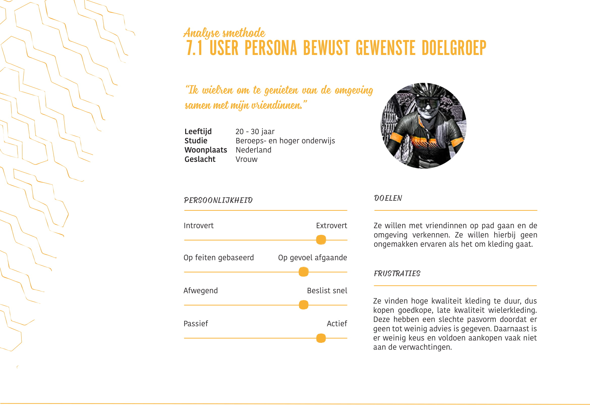
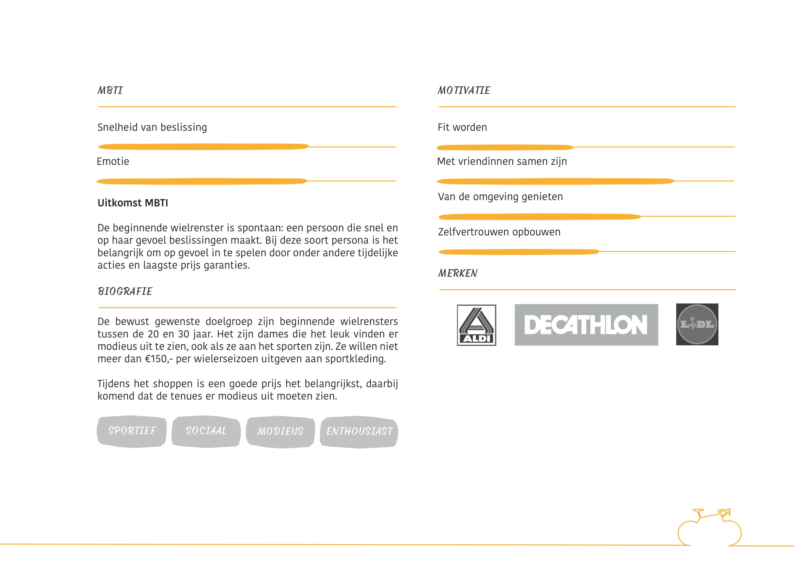
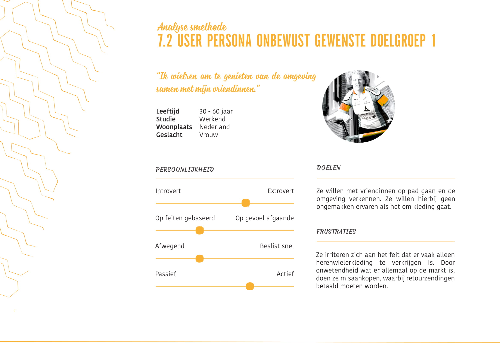
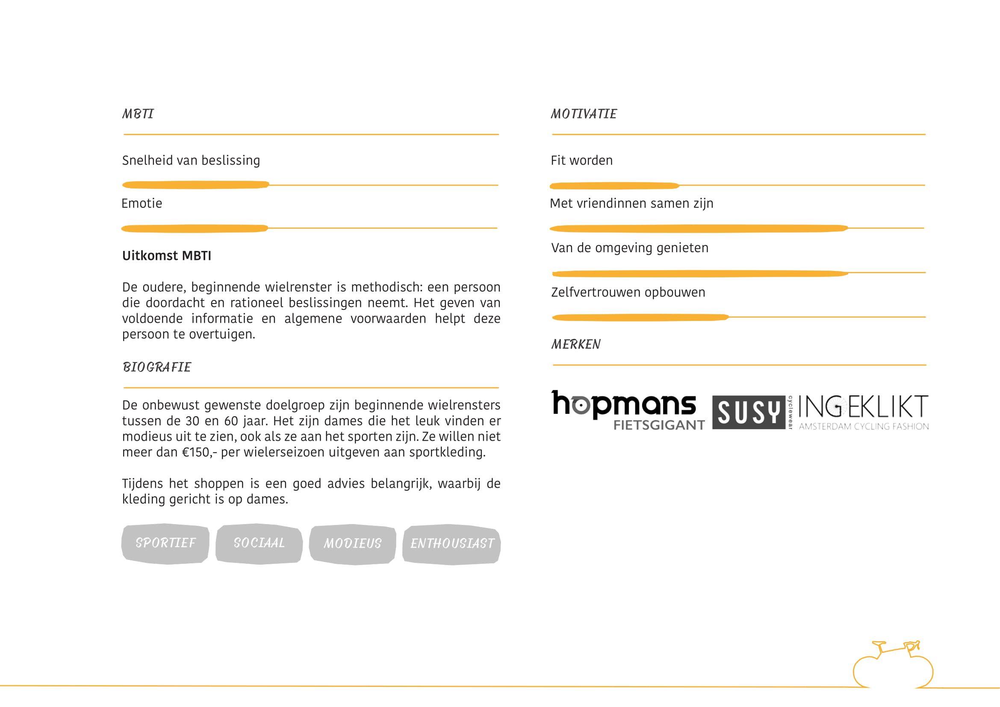
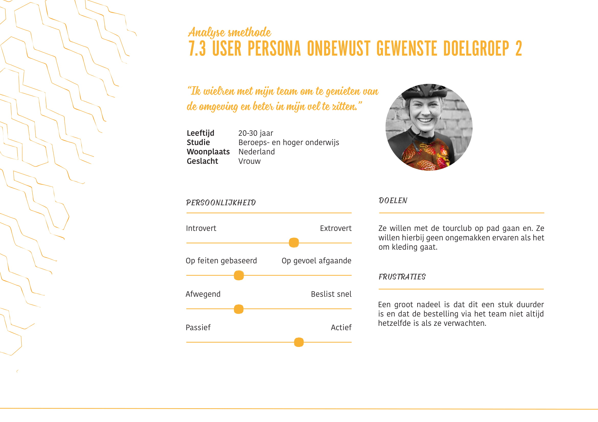
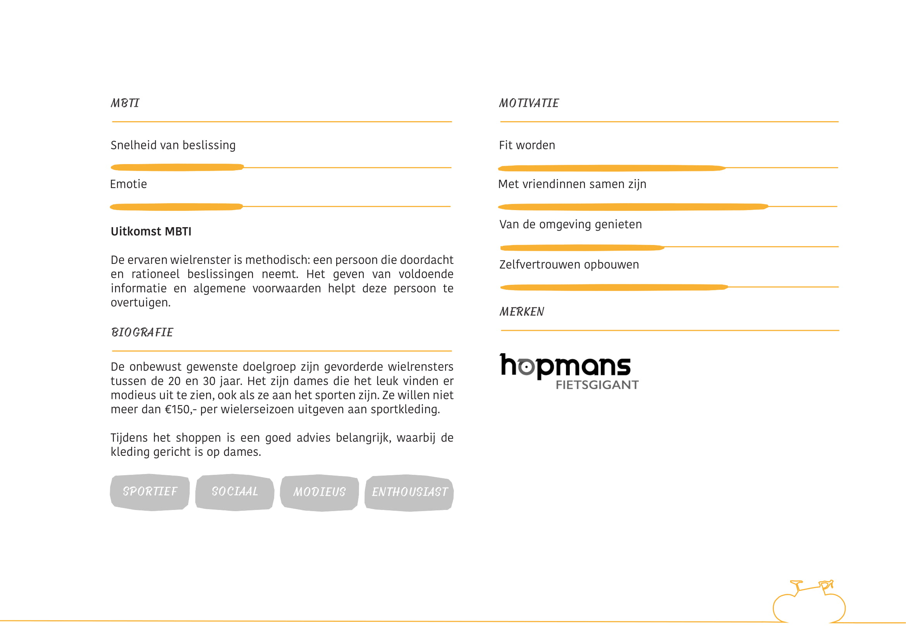
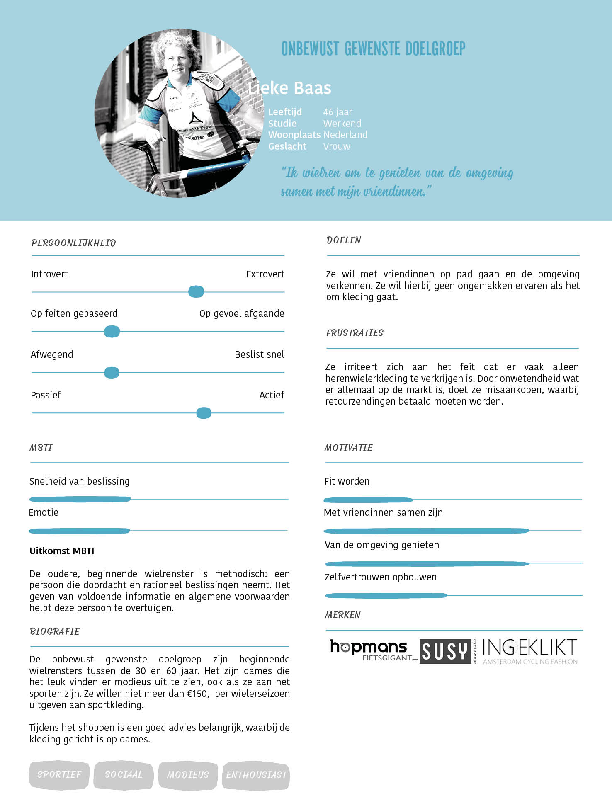
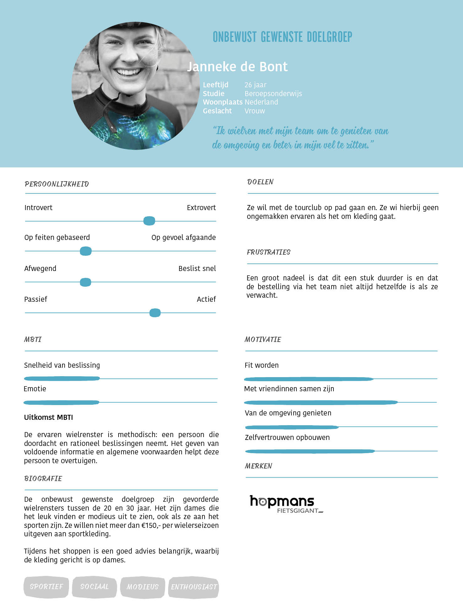

# Persona's



Een persona representeert de gebruiker in discussies over het design. 

Een persona kan als functie hebben om een voorbeeld te zijn om de gebruikers te representeren. Een persona gebruikt het product op een manier dat past bij zijn of haar karakter, gewoontes of doelen. Gebaseerd op user research worden opvallende eigenschappen gebruikt voor de persona. Door observatie en  interviews wordt de persona aangevuld met behoeftes, verwachtingen, doelen, sociale achtergrond, e.d..

Veel design teams gebruiken persona's. Sommige teams gebruiken kant-en-klare persona's van het internet, waardoor veel kostbare informatie verloren gaat.

Er zijn verschillende persona's gemaakt: bewust gewenste doelgroep, onbewust gewenste doelgroep 30-60 jaar en onbewust gewenste doelgroep 20-30 jaar, zie figuur 1, 2 en 3. Figuur 4, 5 en 6 tonen de verbeterde persona's \(versie 2\)

### Persona's versie 1

### Persona's versie 2

> **De persona's zijn gebruikt voor het representeren van de doelgroep tijdens discussies en ontwerpen.**

\*\*\*\*



