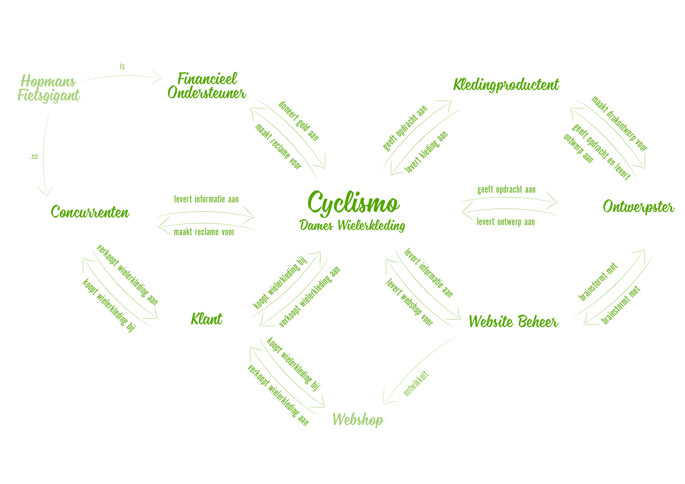

# Stakeholdermap



Alle stakeholders zijn weergegeven in een stakeholder map. Hierin zijn ook de onderlinge relaties en de relatie met de onderneming “Cyclismo” weergegeven, zie figuur 1.

> **De Stakeholder Map is gebruikt voor het in beeld brengen van de stakeholders en het bepalen van de stakeholders tegenover elkaar. De Stakeholders zijn verwerkt in het Programma van Eisen.**

### De financieel ondersteuner

#### Over de Financieel ondersteuner

Wij hebben Wielergigant Hopmans benaderd voor financiële ondersteuning bij de start van ons merk Cyclismo. Hierbij gingen we ervan uit dat we meerdere organisaties hiervoor moesten benaderen om tot een goed totaal te komen. Uit het gesprek met Hopmans bleek dat zij een exclusieve ondersteuner wilden zijn, wat betekent dat er geen andere partijen bij de financiële regeling betrokken mogen worden. 

#### Over de overeenkomst met de Financieel ondersteuner

Een voorwaarde van de financieel ondersteuner was dat hij inzage had in de kosten, daarom is een begroting gemaakt van alle verwachtte kosten. Hierbij zijn het inkopen van de kleding, de webhosting, administratie en ontwerp hulpmiddelen opgenomen. In de berekening is een looptijd van 2 jaar gekozen, omdat het wielerseizoen al aan de gang is als de website online gaat, dus de eerste lijn kleding zal twee wielerseizoenen verkocht worden.  

#### Inkopen kleding

De kleding is geproduceerd bij Barlope. Om geen overschot aan kleding over te houden, is een schatting gemaakt hoeveel kledingstukken wij willen bestellen. Hierbij is rekening gehouden met de reeds bestaande interesse vanuit vrienden en kennissen. Daarnaast is nabestellen bij de kledingontwikkelaar eenvoudig en komen daar geen extra kosten bij kijken, waardoor in kleinere oplages bestellen geen problemen oplevert. Door een deal met de kledingontwikkelaar, hoeft er ook geen rekening gehouden te worden met verzendkosten. 

<table>
  <thead>
    <tr>
      <th style="text-align:left"><b>Aantal</b>
      </th>
      <th style="text-align:left"><b>Maat</b>
      </th>
      <th style="text-align:left"><b>Omschrijving</b>
      </th>
      <th style="text-align:left"><b>Bedrag</b>
      </th>
      <th style="text-align:left"><b>Totaal</b>
      </th>
    </tr>
  </thead>
  <tbody>
    <tr>
      <td style="text-align:left"></td>
      <td style="text-align:left"></td>
      <td style="text-align:left">
        
Wielershirt, korte mouw

        
Textiel: Sport100 (neopreen, polyester)

        
Verdekte stiksels, verdekte rits

        
3 achterzakken, reflectiestrips

        
50mm gripper mouwen

        
50mm gripper zoom

      </td>
      <td style="text-align:left"></td>
      <td style="text-align:left"></td>
    </tr>
    <tr>
      <td style="text-align:left">5</td>
      <td style="text-align:left">XS</td>
      <td style="text-align:left"></td>
      <td style="text-align:left">&#x20AC; 14,99</td>
      <td style="text-align:left">&#x20AC; 74,95</td>
    </tr>
    <tr>
      <td style="text-align:left">10</td>
      <td style="text-align:left">S</td>
      <td style="text-align:left"></td>
      <td style="text-align:left">&#x20AC; 14,99</td>
      <td style="text-align:left">&#x20AC; 149,90</td>
    </tr>
    <tr>
      <td style="text-align:left">10</td>
      <td style="text-align:left">M</td>
      <td style="text-align:left"></td>
      <td style="text-align:left">&#x20AC; 14,99</td>
      <td style="text-align:left">&#x20AC; 149,90</td>
    </tr>
    <tr>
      <td style="text-align:left">10</td>
      <td style="text-align:left">L</td>
      <td style="text-align:left"></td>
      <td style="text-align:left">&#x20AC; 14,99</td>
      <td style="text-align:left">&#x20AC; 149,90</td>
    </tr>
    <tr>
      <td style="text-align:left">5</td>
      <td style="text-align:left">XL</td>
      <td style="text-align:left"></td>
      <td style="text-align:left">&#x20AC; 14,99</td>
      <td style="text-align:left">&#x20AC; 74,95</td>
    </tr>
    <tr>
      <td style="text-align:left">3</td>
      <td style="text-align:left">XXL</td>
      <td style="text-align:left"></td>
      <td style="text-align:left">&#x20AC; 14,99</td>
      <td style="text-align:left">&#x20AC; 44,97</td>
    </tr>
    <tr>
      <td style="text-align:left"></td>
      <td style="text-align:left"></td>
      <td style="text-align:left"></td>
      <td style="text-align:left"><b>Subtotaal shirts</b>
      </td>
      <td style="text-align:left"><b>&#x20AC; 644,57</b>
      </td>
    </tr>
    <tr>
      <td style="text-align:left"></td>
      <td style="text-align:left"></td>
      <td style="text-align:left">
        
Wielerbroek, korte pijpen

        
Textiel: Sport120 (neopreen, polyester)

        
Verdekte stiksels

        
Reflectiestrips onder

        
TD zeem 7 - 10 uur

        
80mm gripper

      </td>
      <td style="text-align:left"></td>
      <td style="text-align:left"></td>
    </tr>
    <tr>
      <td style="text-align:left">5</td>
      <td style="text-align:left">XS</td>
      <td style="text-align:left"></td>
      <td style="text-align:left">&#x20AC; 16,99</td>
      <td style="text-align:left">&#x20AC; 84,95</td>
    </tr>
    <tr>
      <td style="text-align:left">10</td>
      <td style="text-align:left">S</td>
      <td style="text-align:left"></td>
      <td style="text-align:left">&#x20AC; 16,99</td>
      <td style="text-align:left">&#x20AC; 169,90</td>
    </tr>
    <tr>
      <td style="text-align:left">10</td>
      <td style="text-align:left">M</td>
      <td style="text-align:left"></td>
      <td style="text-align:left">&#x20AC; 16,99</td>
      <td style="text-align:left">&#x20AC; 169,90</td>
    </tr>
    <tr>
      <td style="text-align:left">10</td>
      <td style="text-align:left">L</td>
      <td style="text-align:left"></td>
      <td style="text-align:left">&#x20AC; 16,99</td>
      <td style="text-align:left">&#x20AC; 169,90</td>
    </tr>
    <tr>
      <td style="text-align:left">5</td>
      <td style="text-align:left">XL</td>
      <td style="text-align:left"></td>
      <td style="text-align:left">&#x20AC; 16,99</td>
      <td style="text-align:left">&#x20AC; 84,95</td>
    </tr>
    <tr>
      <td style="text-align:left">3</td>
      <td style="text-align:left">XXL</td>
      <td style="text-align:left"></td>
      <td style="text-align:left">&#x20AC; 16,99</td>
      <td style="text-align:left">&#x20AC; 50,97</td>
    </tr>
    <tr>
      <td style="text-align:left"></td>
      <td style="text-align:left"></td>
      <td style="text-align:left"></td>
      <td style="text-align:left"><b>Subtotaal broeken</b>
      </td>
      <td style="text-align:left">&#x20AC; 720,57</td>
    </tr>
    <tr>
      <td style="text-align:left">1</td>
      <td style="text-align:left"></td>
      <td style="text-align:left">Instelkosten*</td>
      <td style="text-align:left">&#x20AC; 50</td>
      <td style="text-align:left">&#x20AC; 50</td>
    </tr>
    <tr>
      <td style="text-align:left">1</td>
      <td style="text-align:left"></td>
      <td style="text-align:left">Verzendkosten</td>
      <td style="text-align:left">&#x20AC; 0</td>
      <td style="text-align:left">&#x20AC; 0</td>
    </tr>
    <tr>
      <td style="text-align:left"></td>
      <td style="text-align:left"></td>
      <td style="text-align:left"></td>
      <td style="text-align:left"><b>Totaal kleding</b>
      </td>
      <td style="text-align:left"><b>&#x20AC; 1425,14</b>
      </td>
    </tr>
  </tbody>
</table>\*De instelkosten gelden alleen bij de eerste levering. Bij een nalevering worden deze niet herberekend. 

#### Webhosting

Het websitebeheer valt onder mijn eigen verantwoordelijkheid. Daarom hoeft er aan het beheer zelf geen bedrag toegekend te worden. Om de site echter te kunnen beheren is er webhosting en een ontwerp omgeving \(Divi\) nodig. 

<table>
  <thead>
    <tr>
      <th style="text-align:left"><b>Aantal</b>
      </th>
      <th style="text-align:left"></th>
      <th style="text-align:left"><b>Omschrijving</b>
      </th>
      <th style="text-align:left"><b>Bedrag</b>
      </th>
      <th style="text-align:left"><b>Totaal</b>
      </th>
    </tr>
  </thead>
  <tbody>
    <tr>
      <td style="text-align:left">2</td>
      <td style="text-align:left"></td>
      <td style="text-align:left">Domein 1 jaar</td>
      <td style="text-align:left">&#x20AC; 7,99</td>
      <td style="text-align:left">&#x20AC; 15,98</td>
    </tr>
    <tr>
      <td style="text-align:left">24</td>
      <td style="text-align:left"></td>
      <td style="text-align:left">
        
Hosting PLUS pakket 1 maand

        
Hoge snelheid, SSD Opslag 100GB,, DDoS beveiliging, Premium Support

      </td>
      <td style="text-align:left">&#x20AC; 4,49</td>
      <td style="text-align:left">&#x20AC; 107,76</td>
    </tr>
    <tr>
      <td style="text-align:left"></td>
      <td style="text-align:left"></td>
      <td style="text-align:left"></td>
      <td style="text-align:left">BTW 21%</td>
      <td style="text-align:left">&#x20AC; 25,99</td>
    </tr>
    <tr>
      <td style="text-align:left"></td>
      <td style="text-align:left"></td>
      <td style="text-align:left"></td>
      <td style="text-align:left"><b>Subtotaal webhosting</b>
      </td>
      <td style="text-align:left">&#x20AC; 149,73</td>
    </tr>
    <tr>
      <td style="text-align:left">2</td>
      <td style="text-align:left"></td>
      <td style="text-align:left">Divi Yearly Access</td>
      <td style="text-align:left">&#x20AC; 89</td>
      <td style="text-align:left">&#x20AC; 89</td>
    </tr>
    <tr>
      <td style="text-align:left"></td>
      <td style="text-align:left"></td>
      <td style="text-align:left"></td>
      <td style="text-align:left"><b>Subtotaal Divi</b>
      </td>
      <td style="text-align:left">&#x20AC; 89</td>
    </tr>
    <tr>
      <td style="text-align:left"></td>
      <td style="text-align:left"></td>
      <td style="text-align:left"></td>
      <td style="text-align:left"><b>Totaal websitebeheer</b>
      </td>
      <td style="text-align:left"><b>&#x20AC; 238,73</b>
      </td>
    </tr>
  </tbody>
</table>#### Administratie KVK en Keurmerk

Om het bedrijf te starten, is een inschrijving bij de KVK nodig. Daarnaast is er budget gereserveerd voor eventuele keurmerken voor op de webshop. Als voorbeeld voor het keurmerk is Thuiswinkel Waarborg genomen, omdat deze een van de bekendste keurmerken is in Nederland als het gaat om webwinkels. Later zal er onderzocht worden welk keurmerk het beste past bij de webshop.

| **Aantal** |  | **Omschrijving** | **Bedrag** | **Totaal** |
| :--- | :--- | :--- | :--- | :--- |
| 1 |  | Eenmalige inschrijfkosten KVK | € 50 | € 50 |
|  |  | Eenmalige inschrijfkosten Thuiswinkel | € 75 | € 75 |
| 2 |  | Thuiswinkel Waarborg per jaar | € 390 | € 390 |
| 2 |  | Thuiswinkel Waarborg contributie | € 150 | € 300 |
|  |  |  | **Totaal administratie** | **€ 815** |

#### Ontwerp hulpmiddelen

Om de kleding te kunnen ontwerpen zijn een aantal hulpmiddelen nodig. Tekengerei en dergelijke is in bezit, daarom worden alleen de kosten die verbonden zijn aan de Adobe Creative Cloud meegerekend in de begroting.

| **Aantal** |  | **Omschrijving** | **Bedrag** | **Totaal** |
| :--- | :--- | :--- | :--- | :--- |
| 2 |  | Adobe Creative Cloud Student All aps | € 19,99 | € 39,98 |
|  |  |  | **Totaal hulpmiddelen** | € 39,98 |

#### Overzicht begroting

| **Onderdeel** | **Totaal** |
| :--- | :--- |
| Kleding | € 1425,14 |
| Websitebeheer | € 238,73 |
| Administratie | € 815 |
| Hulpmiddelen | € 38,98 |
| **Totaal bedrag** | € 2518,85 |

####  Besluiten Financieel ondersteuner

Nadat de begroting getoond was aan de financieel ondersteuner, is de afspraak gemaakt dat hij de start van Cyclismo met €2800,- ondersteund. Dit bedrag moet binnen 3 jaar afgelost zijn, wat ook de enige afspraak is over deze aflossing. 

### De concurrenten

Zie [Competitieve analyse](https://kpmelzakkers.gitbook.io/cyclismo-product-biografie/deelvraag-1/deelvraag-1-or-wat-zorgt-ervoor-dat-de-webshop-voor-dames-wielerkleding-betrouwbaar-is-en-overkomt/subvraag-1-en-2-or-wat-is-een-geen-goed-voorbeeld-van-een-betrouwbare-site-en-waarom/competitieve-analyse).

### De klant

Zie [Persona's](https://kpmelzakkers.gitbook.io/cyclismo-product-biografie/deelvraag-1/deelvraag-5-or-hoe-kan-de-site-voor-iedere-stakeholder-gebruiksvriendelijk-zijn/subvraag-1-or-wie-zijn-de-stakeholders-en-wat-zijn-hun-wensen/personas).

### Het website beheer

Het website beheer valt onder mijn eigen verantwoordelijkheid. Na het afronden van het concept, zal ik zelf de site bouwen door middel van Divi. Het bouwen van de site valt buiten het project.

Doordat ik zelf het beheer doe, weet ik wat ik nodig heb en wat wel en niet mogelijk is. 

### De kledingproducent

Wij hebben onze eigen ontwerpster, waardoor wij alleen een kledingproducent nodig hebben en geen ontwerpbureau. Dit scheelt veel in de kosten, maar we vinden het belangrijk dat de kleding eerlijk wordt geproduceerd. Om dit te bereiken is een fabriek in Portugal aangeschreven. In deze fabriek wordt de kleding van Juffrouw Jansen \(stageplaats propedeuse jaar\) ook geproduceerd. Uit ervaring van Juffrouw Jansen weten we dat dit een betrouwbare fabriek is, waar hoge kwaliteit kleding wordt geleverd. 

De fabriek, Barlope Empresa de Confeccões, is gestationeerd in Barcelos, een paar kilometer boven Porto. De ontwerpster heeft de contacten met de fabriek verzorgd. Om een beeld te krijgen met welk bedrijf wij te maken hadden, hebben wij een bezoek gebracht aan deze fabriek. Wat ons opviel waren de lichte, goed verzorgde werkplaatsen en het enthousiasme waarmee wij ontvangen werden. Voor de ontwerpster was dit een erg leerzaam bezoek, voor mij een interessante kijk achter de schermen.

### De ontwerpster

Floor Verbeek is 24 jaar en heeft de opleiding Fashion Design gevolgd. Hierbij lag haar interesse bij de commerciële mode, wat niet aansloot bij haar opleiding. Daarom is zij eerder gestopt met studeren, om haar eigen lijnen te kunnen gaan ontwikkelen. 

“Mode moet je passen, je moet jezelf prettig voelen. De stof moet dat doen, waar het voor dient. Mode is namelijk niet alleen mooi, het moet ook vooral functioneel zijn. In een wereld waar wij allemaal ambities hebben, alle kanten uitreizen en bomvolle agenda’s hebben, wil ik kleding brengen waar je gelukkig van wordt: het zit niet in de weg en helpt jou je zelfvertrouwen te laten groeien. Dit wil ik ook terugzien in mijn sportkleding. Van alle gemakken voorzien, waardoor de sportster gewoon kan doen waar zij mee bezig is: sporten! 

De samenwerking met Kim binnen Cyclismo is ontstaan door de gemeenschappelijke interesse in wielrennen. En waar zij goed in is, het ontwikkelen van multimedia, en waar ik goed in ben, het ontwikkelen van kleding, kwam hierbij perfect bij elkaar.”



