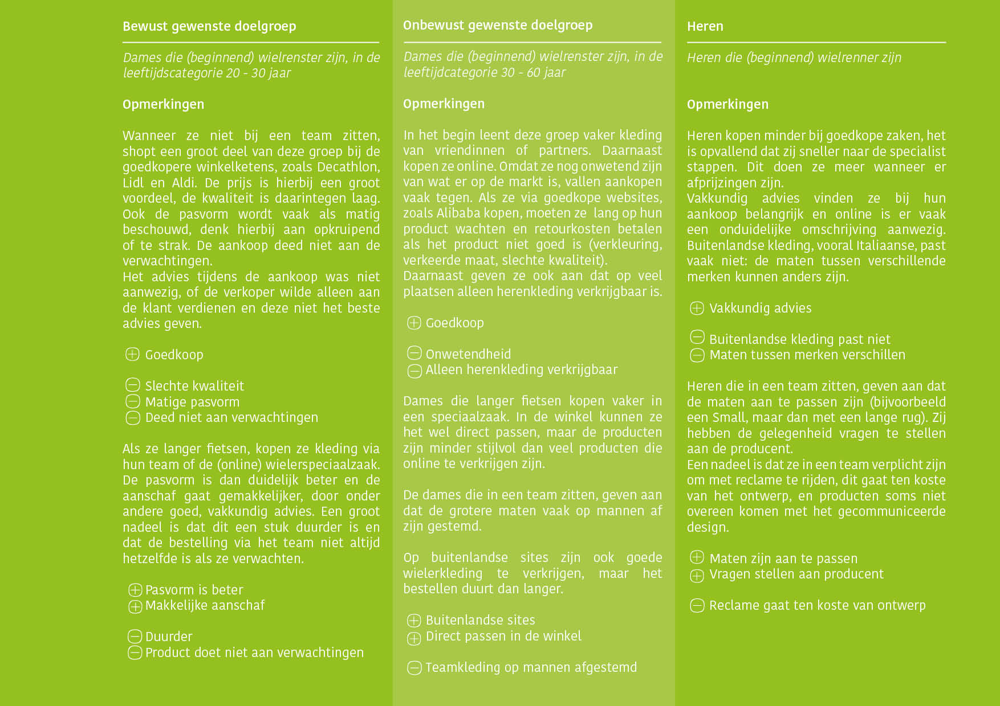
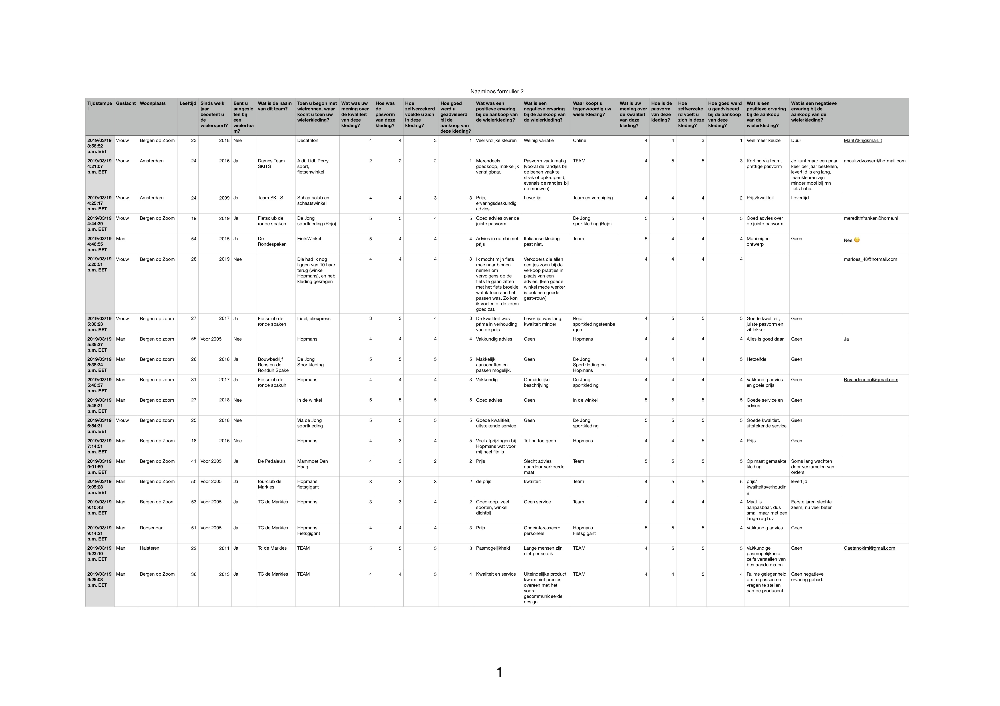
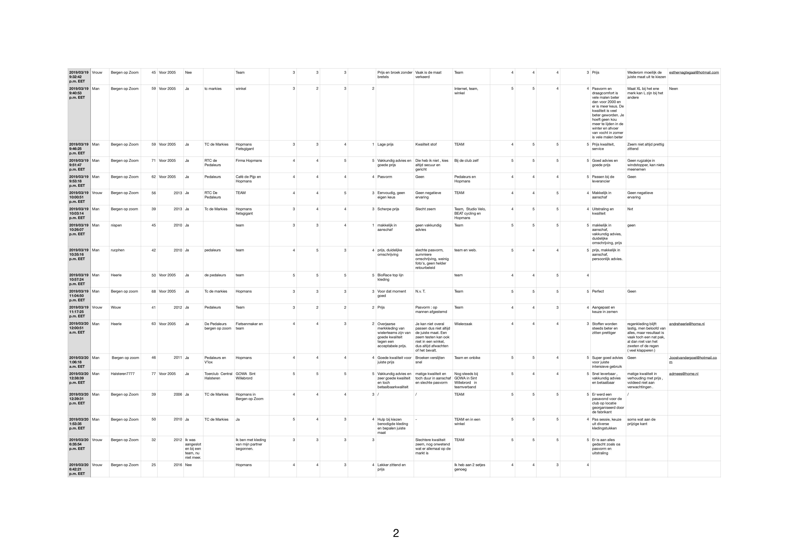
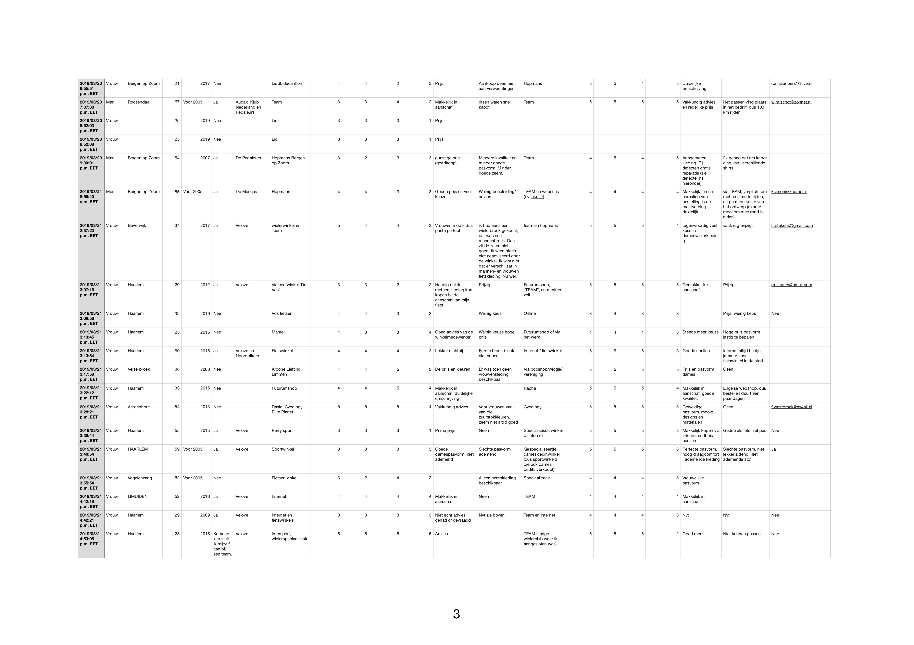
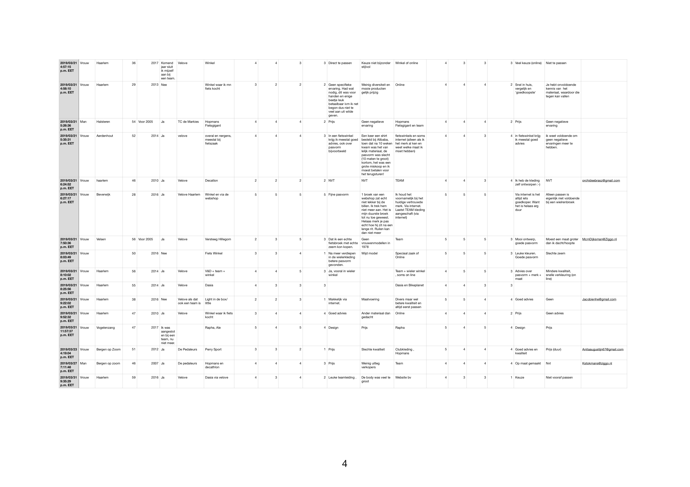

# Vragenlijst



Om een beeld te krijgen van de bewust en onbewust gewenste klanten is gebruik gemaakt van een vragenlijst, voor het verzamelen van vooral kwantitatieve informatie uit een grote groep uit de doelgroep. Een vragenlijst wordt verspreid onder een representatieve groep via de juiste kanalen. Online tools kunnen helpen.

Vragenlijsten worden gebruikt binnen marketing en de vroege stadia van designen. Binnen dit project is het gebruikt binnen de vroege stadia van het designen om de doelgroep in kaart te kunnen brengen. 

De vragenlijst is bedoeld voor het verzamelen van vooral kwantitatieve informatie uit een grote groep uit de doelgroep. Deze moet verspreid worden via de juiste kanalen, online tools kunnen hierbij helpen. 

Om de juiste kanalen te vinden, is onderzoek gedaan naar verschillende enquête tools. De resultaten zijn gerangschikt in een Vergelijkingskaart, figuur 1. Uit deze Vergelijkingskaart is Google Forms het beste naar voren gekomen en zal gebruikt worden voor het opstellen en verzenden van de vragenlijst.

| Naam | Gratis | Mogelijkheden | Resultaten | Snel werken | Exporteren | Minpunten | Toelichting | Totaal |
| :--- | :--- | :--- | :--- | :--- | :--- | :--- | :--- | :--- |
| SurveySwap | 4 | 2 | 3 | 3 | 4 |  |  | 16 |
| Onderzoekdoen.nl | 0 | 4 | 2 | 3 | 2 |  |  | 11 |
| ThesisTools | 4 | 2 | 4 | 2 | 4 | -2 | advertentie | 14 |
| Google Forms | 4 | 3 | 4 | 3 | 4 |  |  | 18 |
| Survio | 4 | 3 | 4 | 2 | 2 |  |  | 15 |
| Enquete maken.nl | 4 | 3 | 2 | 2 | 3 | -3 | vage site | 11 |

### Voorbereiding

De vragenlijst is verspreidt onder dames en heren die de wielersport beoefenen.

Er is gekozen om de vragenlijst ook onder heren te verspreiden, omdat zij wielerkleding aanschaffen en hierbij problemen en voordelen ervaren. De kans is groot dat deze ervaringen ook bij dames voorkomen. 

De resultaten van de vragenlijst zijn onderverdeeld in 3 groepen:

- Bewust gewenste doelgroep: dames die \(beginnend\) wielrenster zijn, in de leeftijdscategorie 20 - 30 jaar

- Onbewust gewenste doelgroep: dames die \(beginnend\) wielrenster zijn, in de leeftijdscategorie 30 - 60 jaar

- Heren die \(beginnend\) wielrenner zijn

De resultaten van de bewust gewenste doelgroep zijn hierbij het zwaarst wegend en de resultaat heren wegen het lichtst mee. 

Er zijn twee vragenlijsten verstuurd. Bij de eerste vragenlijst \(figuur 2a\) waren de vragen te onduidelijk waardoor de meeste antwoorden niet bruikbaar waren. Er is gekozen om de vragen te herformuleren en de vragenlijst opnieuw te verspreiden. Uit deze tweede vragenlijst \(bijlage 1\) zijn meer bruikbare antwoorden voortgekomen.

| Vragenlijst 1 | Vragenlijst 2 |
| :--- | :--- |
| Hoe lang fietst u? | Sinds welk jaar beoefent u de wielersport? |
| Zit u bij een team? | Bent u aangesloten bij een wielerteam? |
|  | Wat is de naam van dit team? |
| Waar kocht u uw wielerkleding? | Toen u begon met wielrennen, waar kocht u toen uw wielerkleding?/Waar koopt u tegenwoordig uw wielerkleding? |
| Hoe zat deze kleding? | Wat was/is uw mening over de kwaliteit van deze kleding? |
|  | Hoe was/is de pasvorm van deze kleding? |
| Voelde u zich prettig in deze kleding? | Hoe zelfverzekerd voelde/voet u zich in deze kleding? |
| Hoeveel informatie kreeg u? | Hoe goed werd/word u geadviseerd bij de aankoop van deze kleding? |
|  | Wat was/is een positieve ervaring bij de aankoop van de wielerkleding? |
|  | Wat was/is een negatieve ervaring bij de aankoop van de wielerkleding? |

Figuur 2a \| Vragen interviews

 

De bruikbare antwoorden zijn verdeeld in de drie eerder genoemde groepen. Een samenvatting van de antwoorde**n**, is te lezen in figuur 2b.

### Uitkomsten Vragenlijst

De uitkomsten van de vragenlijst worden vergeleken met het MBTI model \(zie Bijlage 2: MBTI model\). Het MBTI model bestaat uit 4 soorten persona’s. Voor ieder soort persona is een andere aanpak nodig als het gaat om verkoop. Door er achter te komen in welke van de 4 categorieën de “bewust gewenste doelgroep” valt, wordt duidelijk wat het uitgangspunt van de site moet zijn.

**Bewust gewenste doelgroep, beginnend**

De beginnende wielrenster in de leeftijdscategorie 20 - 30 koopt bij goedkopere winkelketens en geven vooral aan dat de prijs belangrijk is. Het zijn dames die snel en op hun gevoel beslissingen maakt. Zij vallen onder de persona “**Spontaan**”.

**Bewust gewenste doelgroep, gevorderd**

De iets gevorderde wielrenster in de leeftijdscategorie 20 - 30 koopt bij een wielerspeciaalzaak. Ze vinden vakkundig advies belangrijker. Zij vallen onder de persona “**Methodisch**”.

Dat de bewust gewenste doelgroep spontaan is en dominant is, betekent niet dat er niet aan de andere persona’s gedacht moet worden. Ook voor hun moeten er opties aanwezig zijn, waardoor ook zij tot aankoop over gaan.

> _AANPASSINGEN IN BEVINDINGEN_
>
> _De uitkomsten van de survey komt uit dat de bewust gewenste doelgroep ook bestaat uit 2 groepen: beginnend en gevorderd. Tussen deze groepen zit nog veel verschil. De groep “gevorderd” zal onder “onbewust gewenste doelgroep” gaan vallen._



## Bijlage 1 Vragenlijst 2

## Bijlage 2 MBTI model

Het is belangrijk om te weten wie de doelgroep is van het project. Zowel voordat het project gestart wordt, om de Design Brief uit te werken, als tijdens de uitwerking van het project. 

Een bekend classificatiemodel voor het maken van persona’s heeft als basis “voorkeuren”. Het originele Myers-Brigg Type Indicator model bestaat uit 16 persoonlijkheid types en voorkeuren van personen. Roy Williams heeft dit model aangepast voor online toepassing, deze bestaat nog maar uit 2 voorkeuren: emotie en snelheid van beslissing.

Uit dit model, figuur B1, komen 4 persona’s naar voren. Voor ieder soort persona is een andere aanpak nodig als het gaat om verkoop.

1 \| Competitief: een persoon die snel en rationeel beslissingen maakt. Op zoek naar duidelijke voordelen ten opzichte van de concurrent.

2 \| Spontaan: een persoon die snel en op zijn/haar gevoel beslissingen maakt. Belangrijk om op gevoel in te spelen, door middel van tijdelijke acties e.d..

3 \| Methodisch: een persoon die doordacht en rationeel beslissingen neemt, en hier de tijd voor neemt. Het geven van voldoende informatie en algemene voorwaarden helpt deze persoon te overtuigen.

4 \| Humanistisch: een persoon die op zijn/haar gevoel beslissingen maakt, en hier de tijd voor neemt. Hierbij is betrouwbaarheid belangrijk, zoals referenties van klanten3.




