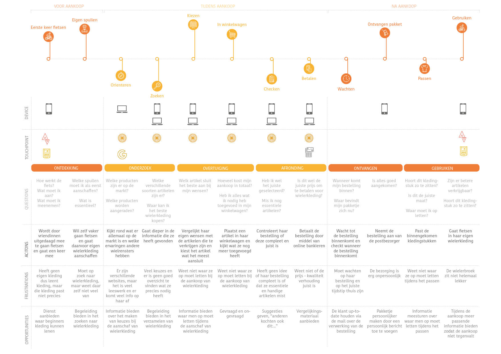

# Subvraag 2 \| Hoe kunnen de wensen van de stakeholders vervuld worden?

Om alle wensen van de Stakeholders te vervullen, wordt gebruik gemaakt van een Plan van Eisen. Hierin worden alle gevonden eisen opgenomen, zodat er geen belangrijke punten vergeten worden. Zie voor het Programma van Eisen deelvraag 3, subvragen 3 en 4.

Daarnaast is een experience map gemaakt, afbeelding 1. Hierin wordt de reis weergegeven die een klant doorloopt tijdens het gebruiken van een product. Frustraties en kansen worden hierbij inzichtelijk gemaakt. 

### Usability regels

Om \(andere\) frustraties te voorkomen, zijn usability regels nageleefd. Hiervoor heeft het boek "The Elements of User Experience" \(Garett, 2011\) als naslagwerk gediend. De belangrijkste onderdelen uit het boek luiden:

User experience gaat niet alleen over het web, maar ook de interactie van producten. Tijdens het ontwerpen moet er rekening gehouden worden met de User Experience. In de Stategy Plane wordt de visie over een product of concept uitgelegd. Vervolgens komt de “Scope Plane” waar de afbakening plaatsvindt. Als laatst komt de “Eye Candy”.

* Stategy Plane: ontdekken wat de User needs zijn. Daarnaast bedenk je wat je wilt bereiken met je product. Persona’s zijn hierbij een goede manier van communiceren.
* Scope Plane: specificeren wat de eisen zijn. Hierbij worden en begin gemaakt aan het Programma van Eisen. De MoSCoW techniek zorgt ervoor dat de eisen verdeeld worden op prioriteit.
* Structure Plane: hierbij wordt de conceptuele structuur van de site aangegeven.
* Skeleton Plane: hierbij komen de eisen uit de Scope Plane aan bod. Er wordt ontworpen naar aanleiding van deze eisen.
* Surface Plane: Op het laatst wordt gekeken naar wat de gebruiker zal zien: de vormgeving.

### 

