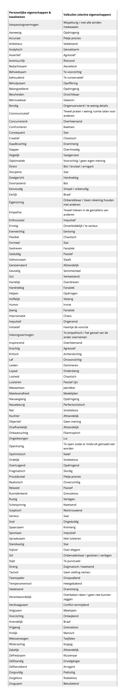
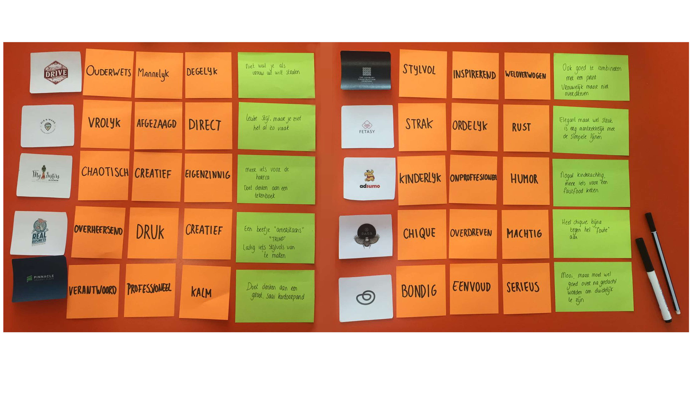

# Focus groep



Om een beeld te krijgen van de voorkeuren voor stijl van de doelgroep, is een Focusgroep gehouden.

### **Ontwerpstijlen**

Bij de eerste methode is zijn foto’s getoond, maar op deze afbeeldingen waren verschillende soorten ontwerpstijlen te zien. De informatie dat naar voren kwam tijdens de Desk Research is hiervoor gebruikt.

De groep heeft door middel van post-it notities meningen gegeven over de verschillende stijlen. Om de deelnemers te ondersteunen, is gebruik gemaakt van een lijst met eigenschappen, zie afbeelding 3. In afbeelding 4 zijn de geordende uitkomsten van de focusgroep te zien. 

> Uit de focusgroep komt naar voren:
>
> * De doelgroep is hip.
> * De doelgroep heeft een voorkeur voor geometrische vormen.

Nadat de methode afgerond was, is een open discussie ontstaan. Tijdens deze discussie zijn een aantal interessante punten naar voren gekomen.

> * Van de doelgroep gaat ongeveer de helft alleen met warm en droog weer fietsen.
> * De doelgroep vond het in het begin lastig om te weten wat zij moesten aantrekken bij verschillende weertypes.
> * Er werd benoemd dat het erg vervelend is als kleding opkruipt tijdens het fietsen.
> * De doelgroep gebruikt liever desktop of tablet als zij producten via een webshop aanschaffen.



