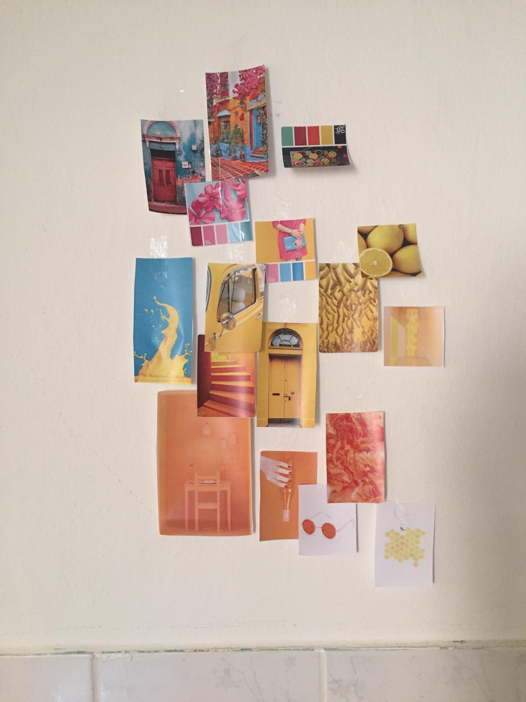
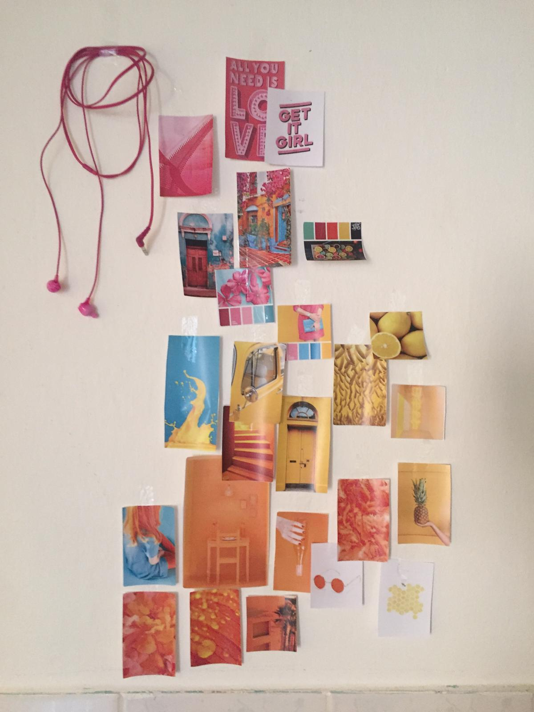
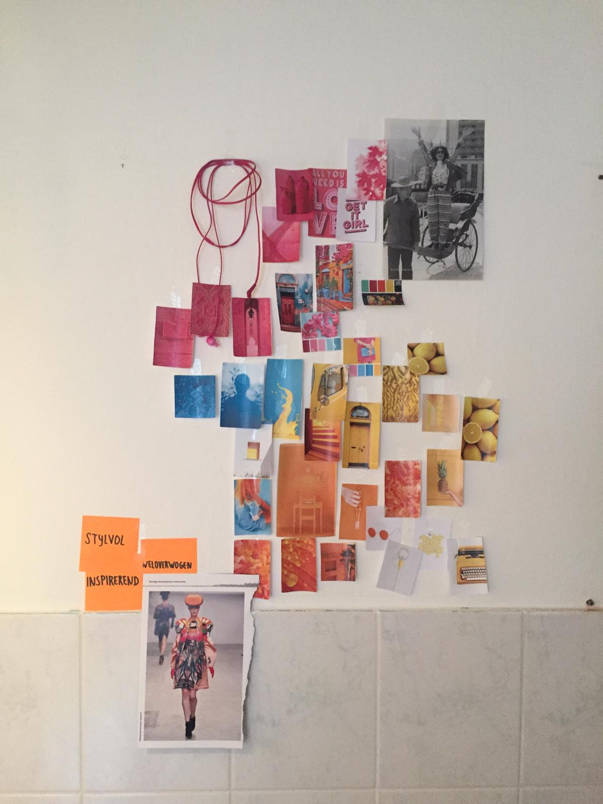
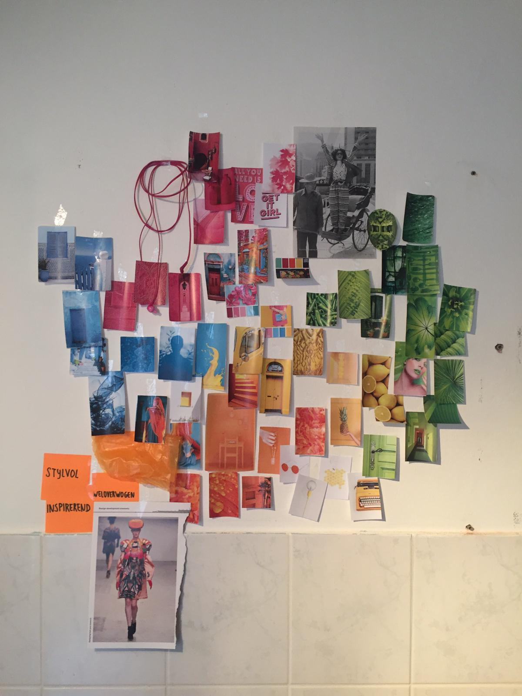
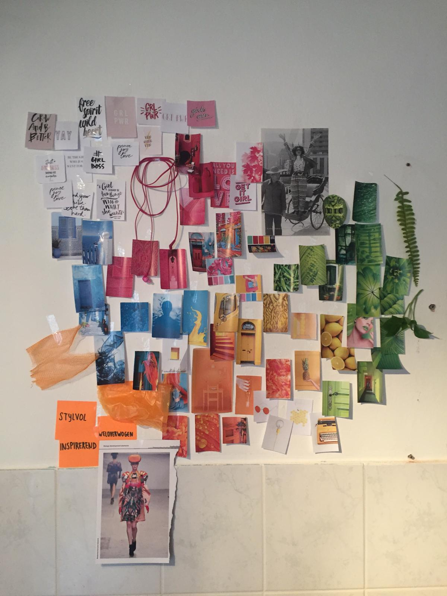

# Inspiration Wall



Samen met de ontwerpster is een Inspiration Wall gemaakt. Dit is een levende methode: de Wall wordt continue bijgewerkt. Het is vooral bedoeld om inspiratie op te doen en ideeën met elkaar te delen.

Afbeelding 1 tot en met 5 tonen de Inspiration Wall in verschillende stadia van het onderzoek. 




