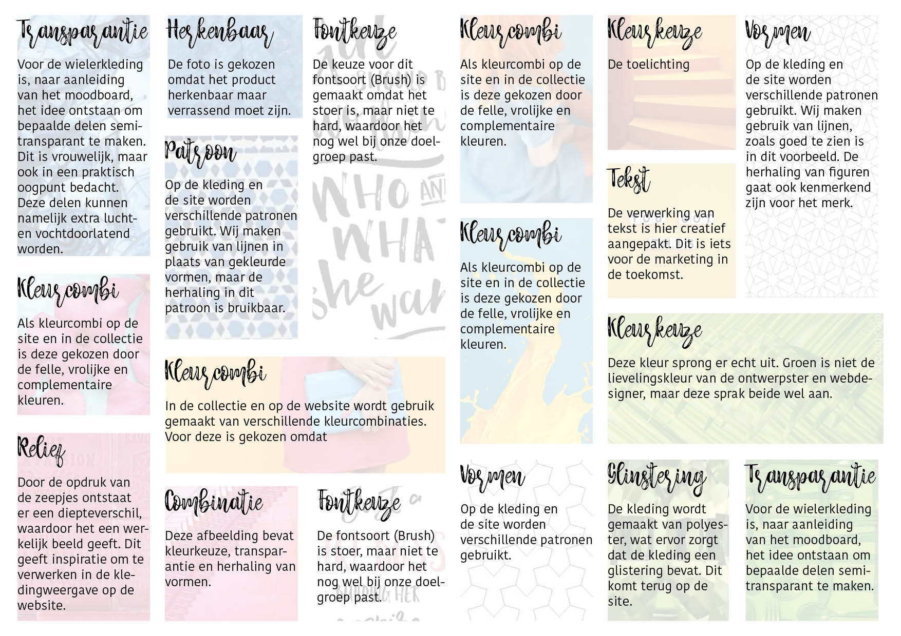

# Moodboard



Een moodboard is een visualisatie van een idee of gevoel, vaak in de vorm van een collage. Door dit hulpmiddel is het makkelijker keuzes te maken en ideeën en een gevoel aan anderen over te dragen. 

Uit de Inspiration Wall zijn de sterkste beelden samengevoegd tot een Moodboard, om betrokkenen in 1 opslag te laten zien welke stijl Cyclismo over moet dragen. Afbeelding 1 toont de gemaakte Moodboard.

De keuzes die gemaakt zijn voor het selecteren van de afbeeldingen, zijn te lezen in afbeelding 2.




