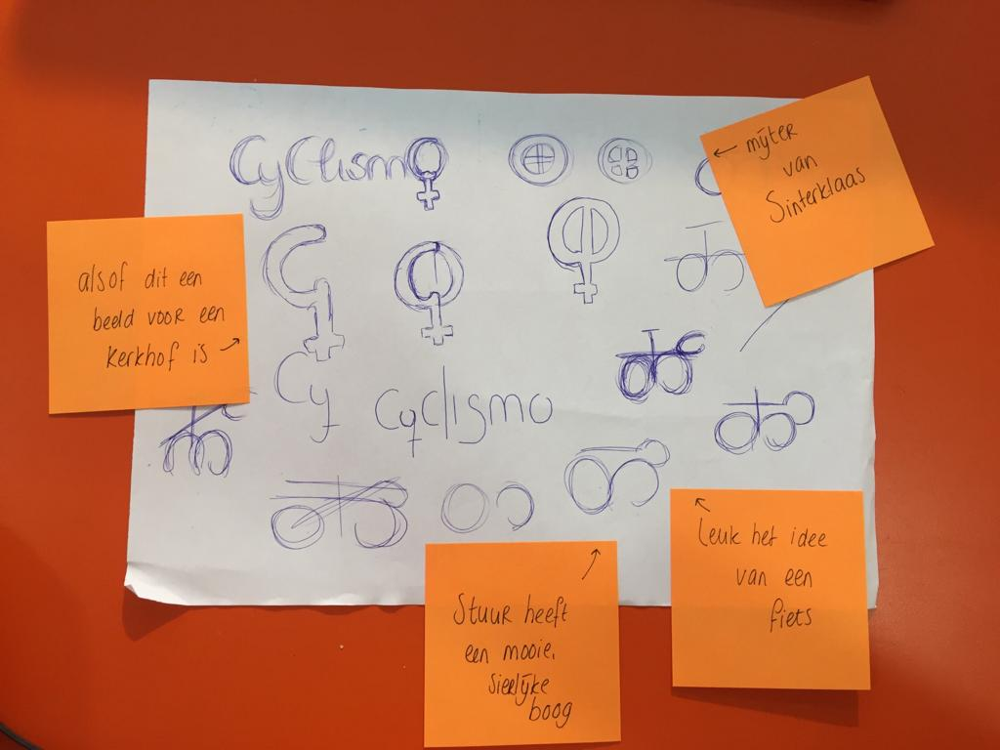
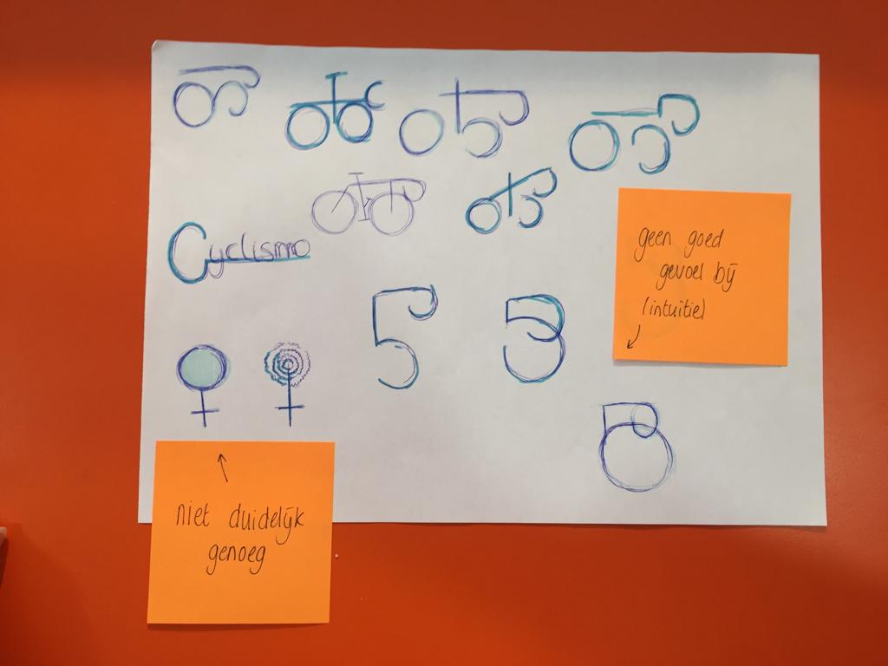
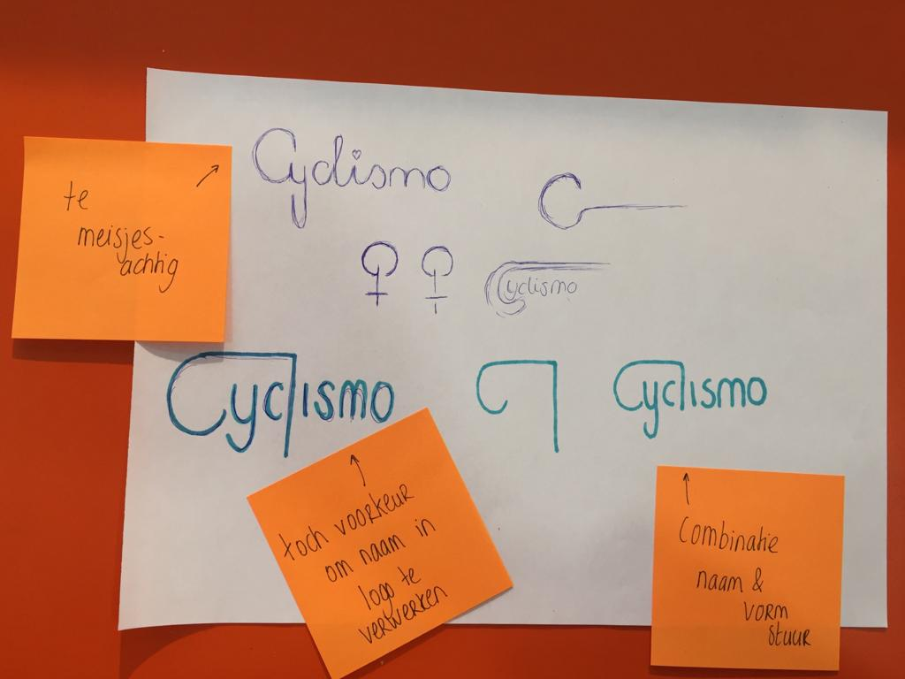
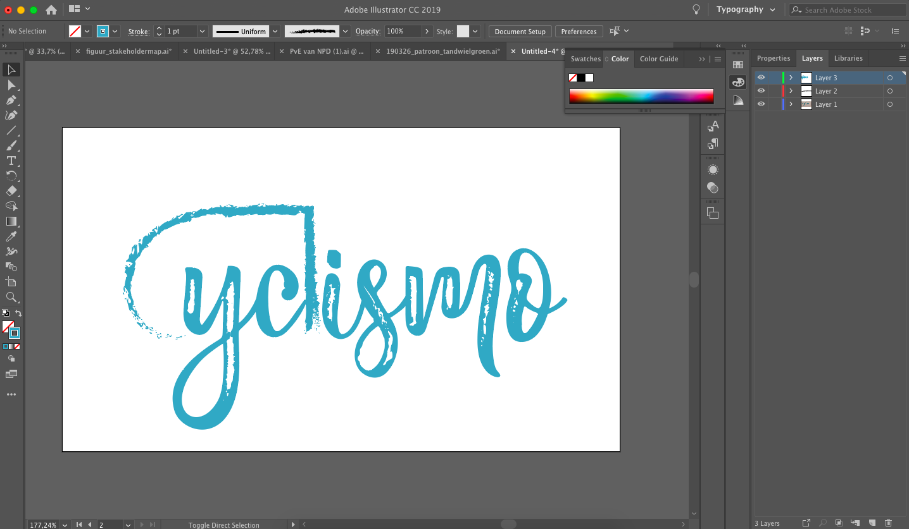
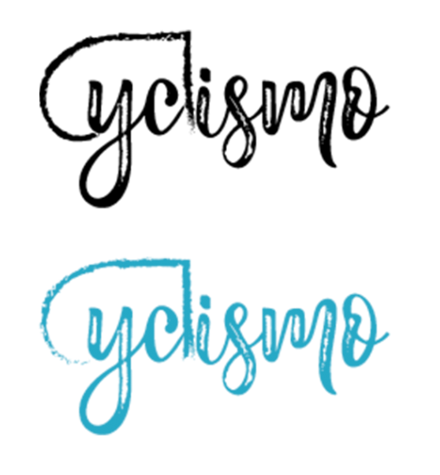

# Sketching



Om een totaal overzicht te krijgen op de Style Tile, is in deze fase ook het logo ontworpen. Door middel van Sketching zijn verschillende varianten geprobeerd, afbeelding 1 tot en met 3. 

Dit is uitgewerkt in Illustrator tot een bruikbaar logo, afbeelding 4 en 5. Er is hier gebruik gemaakt van het Moodboard, zodat het logo bij de rest van de identiteit aansluit. Er is een font gekozen die in dezelfde stijl vormgegeven is, als de fonts op het Moodboard. Daarnaast is het "stuur" \(de combinatie van de C en de L\) ruwer gemaakt, zodat dit los gezien kan worden van het logo, en het stoerdere verwerkt wordt in het logo.




