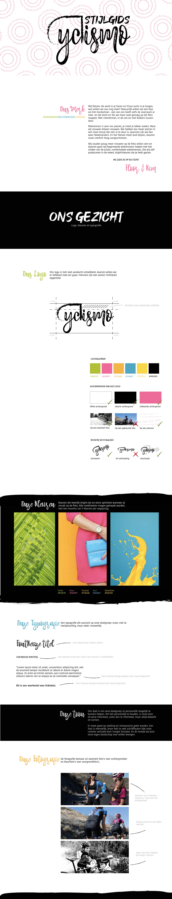

# Style Guide



Een Style Guide is een handleiding met alle details die een rol spelen in de look&feel van een merk. Hierin zijn onder andere typografie, kleuren, logo's en afbeeldingen in opgenomen, zie afbeelding 1. 

> **De stijlgids wordt gebruikt bij het ontwerpen van de webpagina's.**



