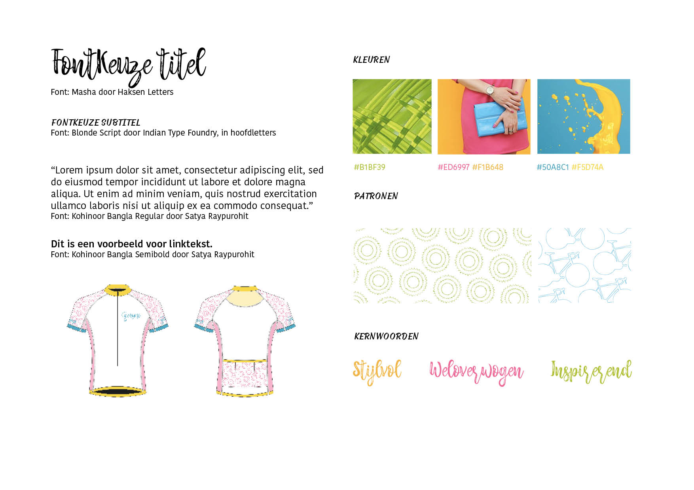

# Style Tile



Style Tiles zorgen voor een visuele richting van een project. Het is een document die de visuele stijl communiceert. Onderdelen als kleuren, typografie en vormen worden hierin opgenomen. 

Een Style Tile is een tegel, waardoor in 1 opslag een indruk gekregen kan worden van de stijl. Hij hoeft niet compleet te zijn, de complete stijl wordt uitgelegd in een de Style Guide.




