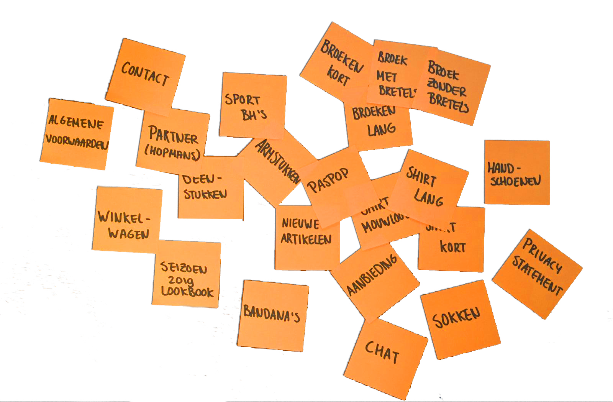

# Sitemap



Ter voorbereiding op de Sitemap is gebruik gemaakt van post-its. Alle nodige pagina's zijn op de post-its geschreven, afbeelding 1.

Een aantal dingen waar op gelet moest worden vanuit het Programma van Eisen waren:

* Hopmans heeft aangegeven dat zij genoemd willen op de site 
* De klant moet gemakkelijk producten kunnen vinden
* De algemene voorwaarden moeten opgenomen worden op de site

Vervolgens zijn ze in de juiste volgorde geordend. 

En zijn er een paar pagina's toegevoegd om het geheel lopend te maken.

Het overzicht is uitgewerkt tot een nette, bruikbare Sitemap.

> **De Sitemap is gebruikt voor het uitwerken van de schetsen en de site.**



