# Benchmark

Om een beeld te krijgen hoe de webshop en kleding bij elkaar aansluiten, is de homepagina  hi-fi uitgewerkt. Daarvoor is een Benchmark uitgevoerd. De uiteindelijk gekozen stijl is meegenomen naar de overige webpagina's.



Door middel van een Benchmark zijn Design Patterns en interessante toepassingen naast elkaar gezet. Deze oplossingen zijn gebruikt als inspiratie op de eigen webpagina's.

### Bekeken websites

De sites die onderzocht zijn, zijn geen webshops voor dames wielerkleding. Hiervoor is gekozen, omdat de bestaande wielerkleding webshops standaard sites zijn met weinig inspirerende oplossingen. Daarom is naar webshops in het algemeen gekeken.

Tijdens het onderzoek zijn de volgende sites onderzocht. Voor deze sites is gekozen omdat volgens Bigcommerce deze sites behoren tot de 22 beste e-commerce websites van 2019. Kieskeurig is gekozen, omdat ik zelf vaak gebruik maak van deze site en het erg prettig vind werken.

<table>
  <thead>
    <tr>
      <th style="text-align:left">Site</th>
      <th style="text-align:left">Soort site</th>
    </tr>
  </thead>
  <tbody>
    <tr>
      <td style="text-align:left">Bliss</td>
      <td style="text-align:left">Webshop gezichtsreiniging</td>
    </tr>
    <tr>
      <td style="text-align:left">Cutter &amp; Buck</td>
      <td style="text-align:left">Webshop kleding</td>
    </tr>
    <tr>
      <td style="text-align:left">Kieskeurig</td>
      <td style="text-align:left">Vergelijkingssite</td>
    </tr>
    <tr>
      <td style="text-align:left">Dezibulls</td>
      <td style="text-align:left">Webshop oorbescherming</td>
    </tr>
    <tr>
      <td style="text-align:left">
        

        
Truelinks Wear

      </td>
      <td style="text-align:left">Webshop schoenen</td>
    </tr>
  </tbody>
</table>### 

De site zal in het begin nog niet veel artikelen bevatten, maar de gebruiker moet wel precies dat vinden wat zij nodig heeft. 

Mensen zoeken op verschillende manieren naar informatie.

* Het gericht zoeken van bekende items.
* Ontdekken
* Verfijnen en versmallen
* Vergelijken
* Een breed idee krijgen
* Details zoeken
* Onbekende dingen ontdekken
* Up-to-date blijven
* Opnieuw vinden

Cyclismo is vooral gericht op de groep die voor het eerst zoekt naar wielerkleding. Daarom is er gezocht op navigatie die het ontdekken, vergelijken en onbekende dingen ontdekken ondersteund.



#### Bliss

Bovenaan staat kort waar het om draait op de site. Daarna komen de producten die net gearriveerd zijn. Ook de bestsellers en de meest belangrijke collectie komen aan bod. Onderaan kunnen bezoekers zich inschrijven voor de nieuwsbrief.

#### Cutter & Buck

Bovenaan worden de aanbiedingen weergegeven, daarna komen de collecties en populaire producten aan bod. 

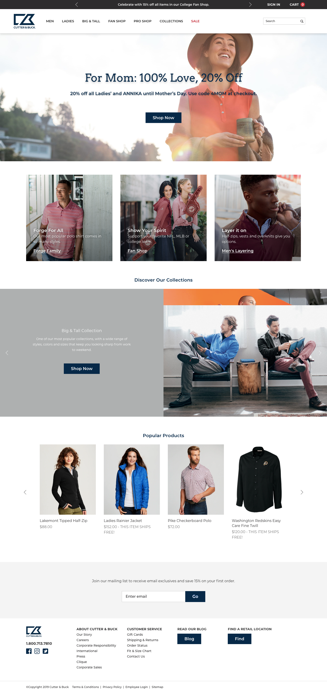

#### Kieskeurig

Op de homepagina van Kieskeurig ziet de bezoeker eerst een blog artikel, waarna populaire categorieën weergegeven worden. Het grootste deel van de pagina bestaat uit een opsomming van alle categorieën. 

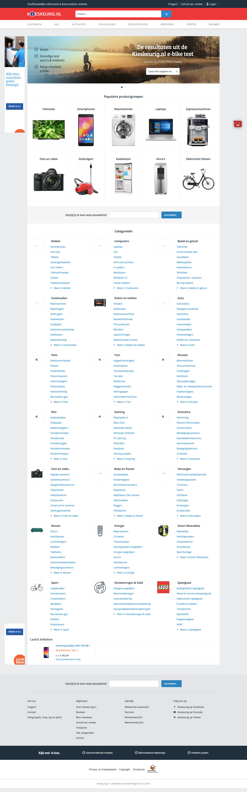

#### Dezibulls 

Bovenaan komen verschillende soorten oorbescherming door beeld, daarna komt een informatiefilm over de oorbescherming. Er worden voordelen genoemd en opmerkelijk is dat onderaan de social media erg groot in beeld gebracht wordt.

#### Truelinks Wear

Bovenaan staat de nieuwste soort schoen, daarna een welkomstbericht. Dit zorgt voor een persoonlijke _touch_.  

> **Interessant is: een persoonlijk bericht op de pagina, bovenaan komt het allerbelangrijkste onderdeel van je site**

Om een overzicht te krijgen van de belangrijkste punten die ik wil verwerken op de Home pagina, heb ik deze opgeschreven op post-its en op volgorde gelegd waarin ze op de Home pagina aan bod moeten komen, zie "Schetsen Home" onder subvraag 3.



#### Bliss

Een webshop die verschillende manieren van zoeken aanbiedt, zie afbeelding 1. Zo zijn via de horizontale dropdown hoofdnavigatie alle producten te vinden. Deze zijn op categorie geordend, maar er kan ook via een zoekbalk gericht gezocht worden op bepaalde producten. Deze methodes zijn niet van toepassing op de doelgroep, maar wat wel erg interessant is, is dat wanneer de gebruiker een zoekwoord intypt, er direct verschillende zoektermen in beeld komen. Zo kunnen ze globaal zoeken, zonder dat ze weten wat er allemaal te verkrijgen is. Een toepassing op de site zou kunnen zijn, dat wanneer de gebruiker "broek" intypt, zoektermen als "korte broek" en "lange broek" in beeld komen, maar ook "beenstukken".

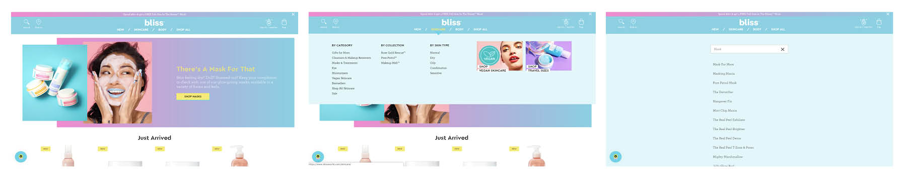

#### Cutter & Buck

Deze webshop biedt ook een horizontale dropdown met categorieën aan, maar daarnaast is op de webpagina zelf ook aandacht besteed aan het zoeken zonder specifiek doel \(ontdekken, onbekende dingen\), zie afbeelding 2. 

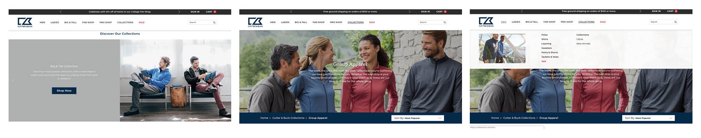

#### Kieskeurig

Op de webshop van Kieskeurig.nl kan de bezoeker zoeken via een zoekbalk met suggesties en een dropdown, gecategoriseerd menu, zie afbeelding 3. Daarnaast kunnen ze ook producten vergelijken. Dit kan op specificaties, maar ook op prijs.

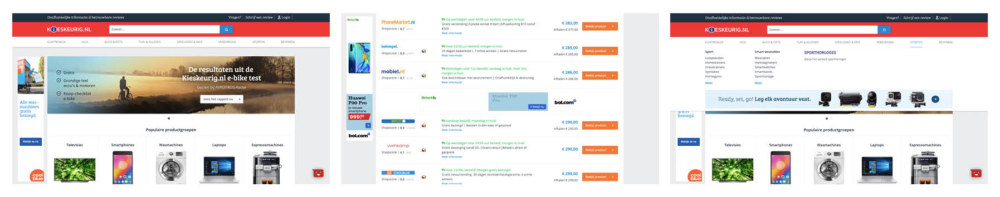

#### Dezibulls 

Dezibulls biedt een horizontale dropdown menu, zie afbeelding 4. In dit menu zijn de meest verkochte artikelen weergegeven, met een foto. Zo komt de bezoeker bij zijn \(waarschijnlijk\) onbewust gezochte product. Wanneer er gezocht wordt via de zoekbalk, worden suggesties met een foto weergegeven.

Om te kunnen vergelijken krijgen producten sterren. Zo kan de bezoeker zien welk product het beste is om aan te schaffen.

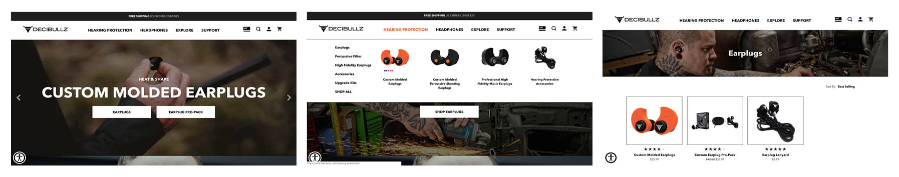

#### Truelinks Wear

De site van Truelinks Wear heeft niet veel producten, zie afbeelding 5. Ze hebben er daarom voor gekozen om alle producten die ze hebben met foto direct in de dropdown te zetten.

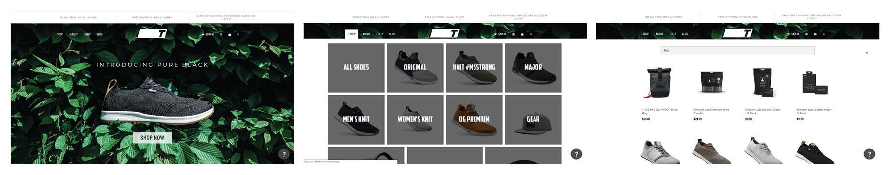

> **Interessant is: alle producten in de dropdown zetten, een vergelijking aanbieden en suggesties geven binnen de zoekbalk.**



#### Bliss

Via Bliss kan er gesorteerd worden op categorie, collectie en huidtype. Daarnaast kunnen producten gesorteerd worden op prijs en meest gewaardeerd.

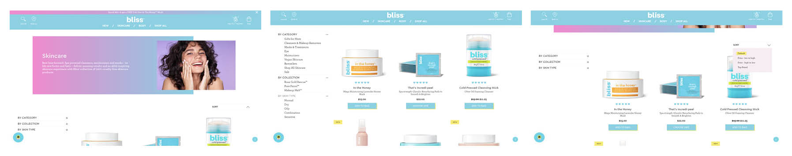

#### Cutter & Buck

Deze webshop biedt meer opties. De gebruiker kan zoeken op categorie. Daarnaast kan de gebruiker filteren op verschillende onderdelen: merk, prijs, maat, kleur en pasvorm. De producten kunnen gesorteerd worden op nieuwste items, van a-z, van z-a en op beoordeling.

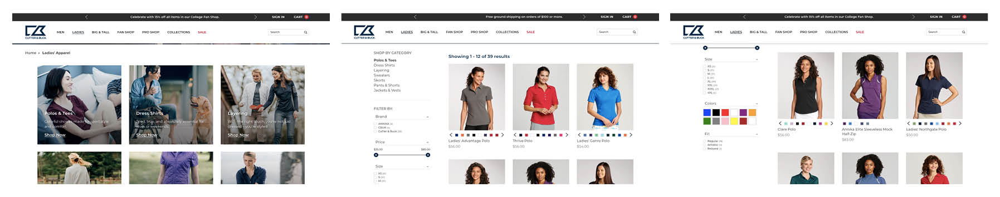

#### Kieskeurig

Kieskeurig biedt veel filteropties. Filteropties die de site aanbiedt zijn:

* Toevoegen van trefwoorden \| zoekbalk
* Prijs \| van, tot
* Merken \| zoekbalk en aanvinken
* Specificaties aangesloten op de categorie \| aanvinken
* Reviewscore \| dropdown menu
* Winkels \| aanvinken

Bovenaan de productenlijst staan de bekendste merken.

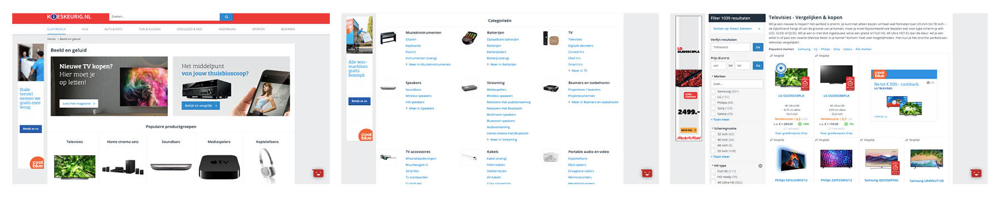

#### Dezibulls 

Dezibulls biedt geen filter opties, omdat er weinig producten aangeboden worden. Wel kunnen producten op verschillende manieren gesorteerd worden:

* Aanbevolen
* Nieuwste
* Meest verkocht
* A tot Z
* Z tot A
* Reviews
* Prijs oplopend/aflopend

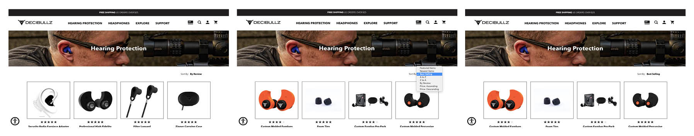

#### Truelinks Wear

De site van Truelinks Wear biedt twee filteropties: op maat en prijs. Dit is genoeg voor de hoeveelheid producten de site aanbiedt. Daarnaast kunnen de producten gesorteerd worden op:

* Aanbevolen
* Nieuwste
* Meest verkocht
* A tot Z
* Z tot A
* Reviews
* Prijs oplopend/aflopend

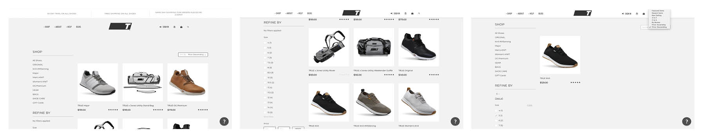

> **Interessant is: alleen die filteropties geven die echt nodig zijn.**



#### Bliss

Fijn aan deze PDP is dat onderaan direct de reviews te lezen zijn, zonder naar een ander tabblad te moeten gaan. De reviews zijn opgebouwd uit een kernwoord, rating door middel van harten en daarnaast een uitgebreidere toelichting.

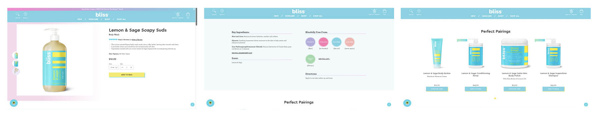

#### Cutter & Buck

Wanneer een andere kleur gekozen wordt, veranderd de afbeelding mee. Daarnaast wordt ook weergegeven wat andere gebruikers interessant vinden.

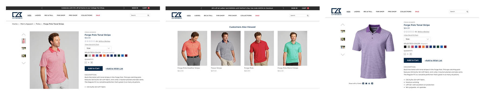

#### Kieskeurig

De laagste prijzen staan bovenaan de PDP, want dit is de hoofdfunctie van de website. Verder is deze pagina erg druk en onoverzichtelijk. Wat wel goed gedaan is, is dat onderaan "aanbevolen voor jou" geplaatst is.

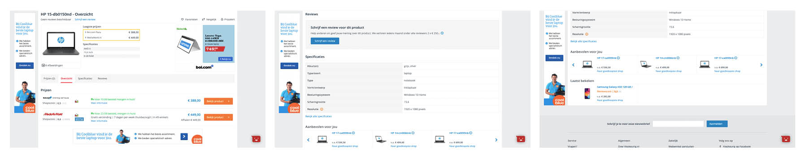

#### Dezibulls 

Dezibulls geeft zijn klanten veel informatie, onder andere door een instructie film. Als de gebruiker geen mogelijkheid of zin heeft om de film te bekijken, is er ook voldoende informatie uitgetypt. 

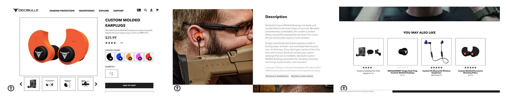

#### Truelinks Wear

Prettig is dat er een overzicht is gemaakt met iconen die aangeven wat de voordelen van het product is. Daarnaast wordt er veel informatie gegeven over het product, zoals materiaal en pasvorm, en kan de bezoeker de items 360 graden ronddraaien.

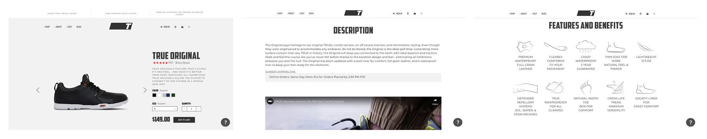

> **Interessant is: duidelijke iconen en afbeeldingen mee laten veranderen wanneer opties veranderd worden.**



**Benchmark**

Pompa, M. \(2019, 13 januari\). The Results Are In: The 22 Best Ecommerce Website Designs of 2019. Geraadpleegd op 27 april 2019, van https://www.bigcommerce.com/blog/best-ecommerce-website-design/

Bliss. \(z.d.\). Bliss® Official Site: 100% Cruelty-Free Face & Body Skincare Products. Geraadpleegd op 29 april 2019, van https://www.blissworld.com/

Cutter & Buck. \(z.d.\). Official Site - Sportswear and Golf Apparel. Geraadpleegd op 29 april 2019, van https://cutterbuck.com

Kieskeurig. \(z.d.\). Vergelijk prijzen en lees reviews & vragen op Kieskeurig.nl. Geraadpleegd op 29 april 2019, van https://www.kieskeurig.nl/

Decibullz. \(z.d.\). Decibullz Custom Molded Earplugs and Earphones. Geraadpleegd op 30 april 2019, van https://www.decibullz.com/

TRUE. \(z.d.\). TRUE linkswear. Geraadpleegd op 29 april 2019, van https://truelinkswear.com/

**B \| Navigatiemenu**

Toxboe, A. \(z.d.\). Design patterns: Navigation. Geraadpleegd op 26 april 2019, van http://ui-patterns.com/patterns/navigation/list



