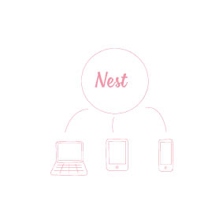

# Extra: Desk Research



Wanneer je \(nog\) niet genoeg van een onderwerp af weet, denk aan de context van een project, kan door Desk Research meer informatie ingewonnen worden. 

\*\*\*\*



In The Finest 50 worden de vijftig beste praktijkvoorbeelden van online verkoop beschreven. De auteurs leggen de geheimen achter de succesvolle websites bloot en beschrijven nieuwe ontwikkelingen op het gebied van business modellen, OMNI Channel, UX, conversie en service.

**INLEIDING**

Tijden veranderen, dus “zo doen we het altijd” is een dooddoener. 

**NIEUWE BUSINESS MODELLEN**

**NuTestament**

Het voordeel van NuTestament is dat gebruikers zelf persoonlijke keuzes kunnen maken, in gewone taal en wanneer hun dat uitkomt. Daarnaast is het ook efficiënter voor notarissen en andere stakeholders.

**Ace&Tate**

Zij maken gebruik van het principe “wie zelf ontwikkeld, betaald geen licenties”.

**ThirdLove**

ThirdLove heeft een applicatie waarmee gebruikers eenvoudig hun maten kunnen opnemen. 

Het algoritme vertaalt de maten naar de juiste confectiemaat. Daarna wordt een persoonlijke product selectie weergegeven.

**Amazon**

Amazon heeft een onverwachte samenwerking met game ontwikkelaars. Gamers kunnen vanuit de games producten kopen, via een API.

**FiscAlert**

Hier wordt door de klant bepaalt wat zij/hij betaalt. Het straalt vertrouwen uit en abonnees zijn vaak loyaal.

**Stocksy**

Aangesloten fotografen zijn mede-eigenaar. Hierdoor voelen zij zich verantwoordelijk voor goede foto’s.

**OMNI CHANNEL**

Er komen meer merken, kanalen en devices. OMNI channel richt zich op ‘touchpoints’ en de overall ervaring van de klant van het merk. Merken moeten de klant toegevoegde waarde bieden op het juiste moment in de journey.

De basis is het verzamelen en analyseren van big data. En daarbij eigen data \(klantprofiel\) te koppelen aan externe databronnen \(weer\). 

**Burberry**

Bij Burberry laten ze zien hoe de kleding gemaakt wordt. Ze biedt persoonlijke content die overal toegankelijk is.

**Aurora**

‘Everywhere anywhere’ beleid: alle kleding is overal te kopen \(het laatste exemplaar in Londen kan online in Amsterdam gekocht worden\). De voorraad tussen alle online en fysieke kanalen worden verbonden en inzichtelijk gemaakt.

**Kiddicare**

In fysieke winkels scannen klanten producten om meer informatie te krijgen.

**Shop Elsewhere**

Via QR codes kunnen klanten tips krijgen waar bijpassende kledingstukken gevonden kunnen worden, bij de concurrent.

**Adidas**

Adidas heeft een windowshop gelanceert: een winkelruit waar je online kunt shoppen zonder de winkel binnen te gaan.

**USER EXPERIENCE**

E-commerce heeft twee soorten e-tailers: de ‘dozenschuiver’ en de ‘specialist’. Daarnaast zijn er ook e-shops die niet leunen op schaal en snelheid, maar hun kracht ergens anders uit putten: unieke gebruikerservaring, sterke band met gebruikers of een specialistische functionaliteit.

**Fashion** **Lens**

Met een applicatie kunnen klanten hun camera gebruiken om te winkelen op basis van kleur \(kleurscanner\).

**BetaBrand**

Bij BB moeten klanten zich eerst inschrijven voor een concept van kleding, voordat het geproduceert wordt. Dit gaat alleen door bij genoeg aanmeldingen.

**Beautybox**

Hierbij laten klanten het shoppen over aan experts en laten het als ‘cadeautje’ bij hun thuis bezorgen.

**Fancy**

De klanten van Fancy krijgen een herinneringsmail wanneer ze nog producten in hun winkelwagen hebben zitten. Daarbij kan het ook goed zijn om een ‘wellicht vind je dit ook interessant’ toe te voegen.

**RentTheRunway**

‘User Generated Experience’: niet \(alleen\) foto’s van modellen, maar ook van klanten.

**CONCERSIE OPTIMALISATIE**

Zorg dat de juiste persoon, op het juiste moment, de juiste boodschap in de juiste tone-of-voice via het juiste kanaal krijgt. 

- Neem niet zomaar aan dat een regel ook voor jouw site geldt.

- Conventies veranderen.

- Test altijd alles en doe dit continue. Laat je leiden door onderzoek. Alles wat de klant doet, is meetbaar.

**O’Neill**

Voor iedere device hebben zij een responsive design.

**Bravissimo**

WeatherFit is een add-on die het mogelijk maakt advertenties te laten zien naar aanleiding van realtime, lokale weersomstandigheden.

**Staples**

Prijzen zijn bij Staples dynamisch en passen zich aan op basis van de tijd van de dag, de dag van de maand of huidige conversie.

**WakkerDier**

Hou rekening met de herkomst van de bezoeker \(zoekmachines, Ads\)

**NeimanMarcus**

Toon gepersonaliseerde resultaten aan mobiele gebruikers op basis van eerder zoekgedrag op desktop.

**SERVICE & LOYALTY**

Inzetten op customer experience is een must. Klanten gaan ervan uit dat de basis, product en prijs, in orde is. Daarom maakt klantenservice het verschil. De relatie tussen bedrijf en klant wordt steeds menselijker.

**ASOS**

De klant kan het pakket volgen in locatie en tijd.

**T-Mobile**

Chatscherm popt op bij een onzekere klant.

_“Branded Utility is een extra dienst die gekoppeld is aan een product of merk.”_ 

**Landal**

Landal biedt persoonlijk getinte informatie op het moment dat het voor de klant interessant is.



  
Een voorbeeld van Branded Utility is Appie van Albert Heijn, Nike+ van Nike en Toon van Essent.

Een “Branded Utility” is een dienst die gekoppeld is aan een product of merk2. Deze dienst is er om toegevoegde waarde te bieden, waarbij de klant binding voelt met jouw product of dienst. Dit draagt \(in\)direct bij aan verkoop

Een BU moet aan een paar voorwaarden voldoen:

- Het is op dagelijkse basis te gebruiken.

- Het moet invulling geven aan waar je klanten behoefte aan hebben.

- Het moet persoonlijk zijn.

- De klant moet de utility missen wanneer hij/zij stopt met het gebruik.

Een BU hoeft niet per se een applicatie te zijn. Omdat klanten vaak verschillende devices gebruiken, is een multiplatform de uitkomst. Een voorbeeld hiervan is Nest \(figuur 1\).

Hoe gepersonaliseerder de utility, hoe efficiënter. Als klanten over willen stappen naar de concurrent, zijn ze hun verzamelde data kwijt: dat willen ze niet.




  
Door het toepassen van de MoSCow techniek, kan een product beter aansluiten bij de wensen van de gebruiker.4 Het gebruik van de Agile-techniek zorgt ervoor dat het een product wat men nodig hebt en dat hoeft niet het product te zijn wat men voor ogen had.

Vereisten zijn de dingen die een stakeholder wil hebben. Hiervoor moet samen gezeten worden met deze stakeholder en gevraagd worden naar hun vereisten. Deze vereisten zullen niet even belangrijk zijn. Prioriteit geven aan eisen is een belangrijke manier om de minimunvereisten te identificeren. Om dit te doen kan gebruik gemaakt worden van MoSCoW: Must Have, Should Have, Could Have, Won’t have. 

- Must have: fundamentele vereisen. Zonder deze vereisten zou het project niet de moeite zijn om te leveren.

- Should have: belangrijke maar niet essentiele vereisten. Voor deze vereisten kan ook een tijdelijke oplossing gezocht worden.

- Could have: bijkomende vereisten. Deze kunnen weggelaten worden, maar zouden wel een toevoeging leveren.

- Won’t have: optionele vereisten. Aan deze eisen hoeft het product nu niet te voldoen, maar kan in de toekomst aan gedacht worden.

Met MoSCoW moet meer gedacht worden over resulaten in plaats van gedetailleerde opleveringen.



The Finest 50 

Besselink, T., Grimberg, G. J., Smits, G. J., Steege, T. E. R., & Besselink, E. \(2010\). Finest Fifty e-commerce 2010: de vijftig beste praktijkvoorbeelden op het gebied van e-commerce 2010. Woerden, Nederland: Beerens Business Press B.V.

Branded Utility

Galesloot, L., & Lamboo, J. \(2013, 23 april\). Branded utilities: zo verover je het hart van je klant! - Frankwatching. Geraadpleegd op 13 maart 2019, van https://www.frankwatching.com/archive/2013/04/24/branded-utilities-zo-verover-je-het-hart-van-je-klant/

Persona MBTI Model

Badenbroek, A. \(z.d.\). Persona’s volgens het MBTI model. Geraadpleegd op 29 maart 2019, van https://www.onetomarket.nl/blog/online-marketing/personas-volgens-het-mbti-model/

MoSCoW methode

Peet, C. \(2018, 19 november\). Importance in projects. Geraadpleegd op 4 april 2019, van https://www.lynda.com/Project-Management-tutorials/Importance-projects/718626/5004907-4.html?srchtrk=index%3a1%0alinktypeid%3a2%0aq%3amoscow+%0apage%3a1%0as%3arelevance%0asa%3atrue%0aproducttypeid%3a2



