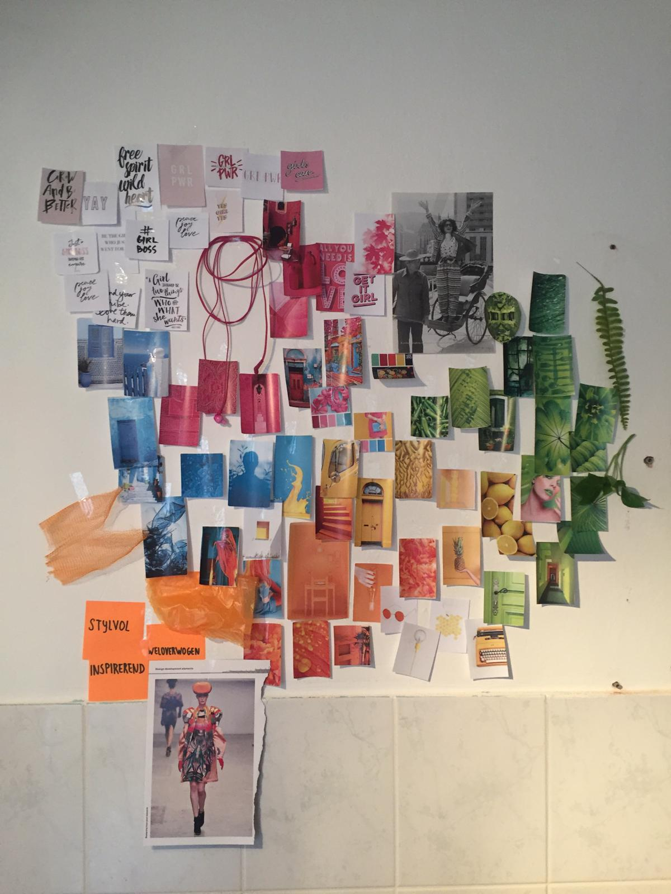
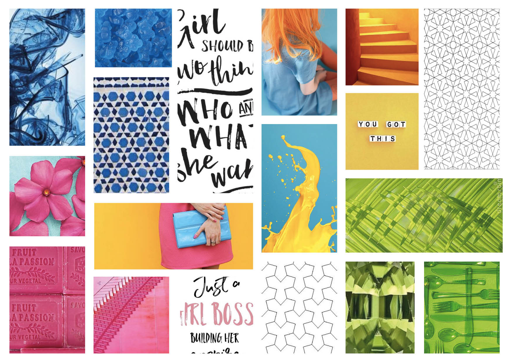
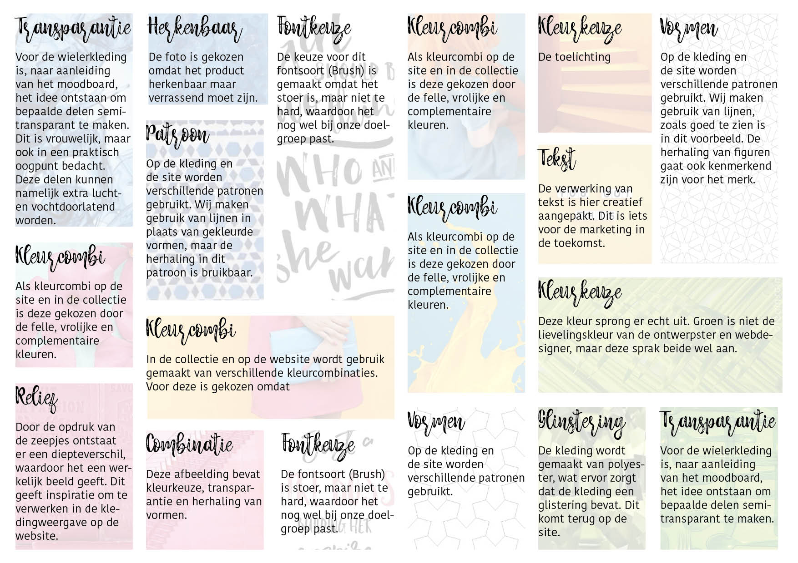
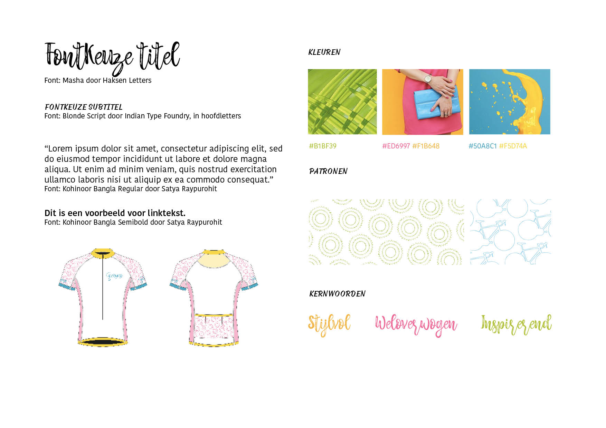
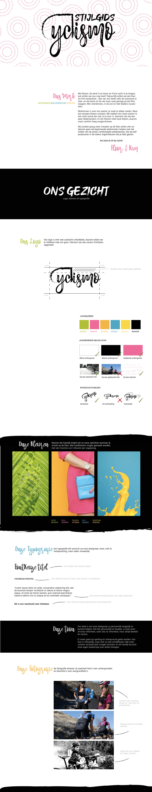

# De onderzoeksfase \| De Look&Feel


Tijdens het proces waarin de Look&Feel ontwikkeld werd, is echt een beeld van Cyclismo ontstaan. Er wordt ook zelf kleding geproduceerd en door een beeld te scheppen van het merk, kwam er een connectie tussen het idee, merk, website en kleding. Het plaatje is in dit proces compleet gemaakt.


## Stijl van de doelgroep

Door middel van een [Desk Research](https://kpmelzakkers.gitbook.io/cyclismo-product-biografie/deelvraag-1/deelvraag-6-or-hoe-gaat-de-vormgeving-van-de-webshop-eruit-zien/subvraag-1-or-welke-look-and-feel-past-bij-de-doelgroep/desk-research) en een [Focus groep](https://kpmelzakkers.gitbook.io/cyclismo-product-biografie/deelvraag-1/deelvraag-6-or-hoe-gaat-de-vormgeving-van-de-webshop-eruit-zien/subvraag-1-or-welke-look-and-feel-past-bij-de-doelgroep/focus-groep), ondersteund door de persona's, is gekeken wat de doelgroep als stijl toepasselijk vind voor het merk Cyclismo. Hieruit kwam dat de doelgroep een voorkeur heeft voor geometrische vormen en hippe kleuren.

> **De voorkeur voor geometrische vormen en hippe kleuren is meegenomen in het moodboard.**

## Ontwikkelen Look & Feel met de ontwerpster

Samen met de ontwerpster zijn [brainstormsessies](https://kpmelzakkers.gitbook.io/cyclismo-product-biografie/deelvraag-1/deelvraag-6-or-hoe-gaat-de-vormgeving-van-de-webshop-eruit-zien/subvraag-2-or-hoe-wordt-de-look-and-feel-doorgevoerd-in-de-webshop/brainstorm-ontwerpster) verricht, welke verwerkt zijn in een [inspiration wall](https://kpmelzakkers.gitbook.io/cyclismo-product-biografie/deelvraag-1/deelvraag-6-or-hoe-gaat-de-vormgeving-van-de-webshop-eruit-zien/subvraag-1-or-welke-look-and-feel-past-bij-de-doelgroep/inspiration-wall), zie figuur 15a, en een [mindmap](https://kpmelzakkers.gitbook.io/cyclismo-product-biografie/deelvraag-1/deelvraag-6-or-hoe-gaat-de-vormgeving-van-de-webshop-eruit-zien/subvraag-2-or-hoe-wordt-de-look-and-feel-doorgevoerd-in-de-webshop/brainstorm-ontwerpster). De uitkomsten van de inspiration wall en de mindmap zijn vervolgens omgezet in een [moodboard](https://kpmelzakkers.gitbook.io/cyclismo-product-biografie/deelvraag-1/deelvraag-6-or-hoe-gaat-de-vormgeving-van-de-webshop-eruit-zien/subvraag-1-or-welke-look-and-feel-past-bij-de-doelgroep/moodboard), figuur 15b en 15c.

Naast de Feel is door middel van [Sketching](https://kpmelzakkers.gitbook.io/eindopdracht-webshop-ciclismo/deelvraag-1/deelvraag-6-or-hoe-gaat-de-vormgeving-van-de-webshop-eruit-zien/subvraag-2-or-hoe-wordt-de-look-and-feel-doorgevoerd-in-de-webshop) ook een logo ontworpen voor het merk, figuur 16.

> **De moodboard en het logo zijn verwerkt in de Style Tile en Style Guide, maar dienen er ook voor om betrokkenen in 1 opslag te laten zien welke stijl Cyclismo over moet dragen.**

## Documenteren Look & Feel 

### Style Tile

Een Style Tile is een tegel, waardoor in 1 opslag een indruk gekregen kan worden van de stijl. De complete stijl wordt later uitgelegd in een Style Guide.


De keuze voor een Style Tile is genomen, zodat de ontwerpster en ik op 1 lijn zaten qua look&feel van het merk, voordat een start gemaakt werd aan de Style Guide.


De Style Tile zorgt voor een visuele richting van het project: het communiceert de visuele stijl. Onderdelen als kleuren, typografie en vormen zijn in de Tile opgenomen, zie figuur 17.

### Style Guide

De Style Guide is een handleiding met alle details die een rol spelen in de look&feel van een merk, figuur 18. 


Als resultaat heeft de Style Guide ons het meeste geholpen. Deze geeft echt weer waar het merk voor staat en hier vanuit zijn de schetsen van de schermen vertaald naar HiFi ontwerpen.  Al het gedane onderzoek komt in de Style Guide terug, er is bewust gekozen voor deze stijl, en er is nog vaak teruggepakt op de Style Guide door mij, maar ook door de ontwerpster bij het ontwikkelen van de kleding. 


> **De Style Guide dient als basis voor de ontwerpfase. Samen met de resultaten uit de onderzoeksfase \(**[**Programma van Eisen**](https://kpmelzakkers.gitbook.io/cyclismo-product-biografie/deelvraag-1/deelvraag-3-or-hoe-wordt-de-webshop-gevalideerd/subvraag-3-or-op-welke-voorwaarden-wordt-de-webshop-beoordeeld)**\) is dit de handleiding voor het ontwerpen van de site.**

