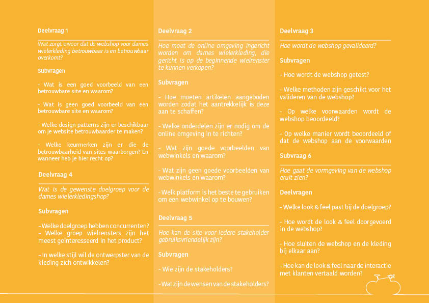
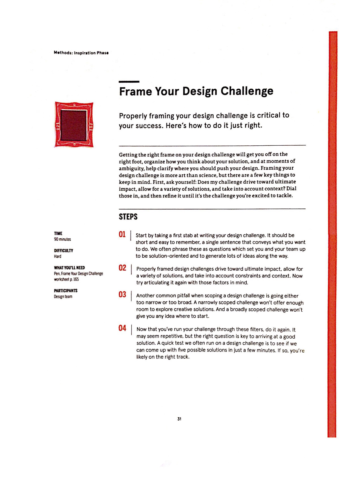
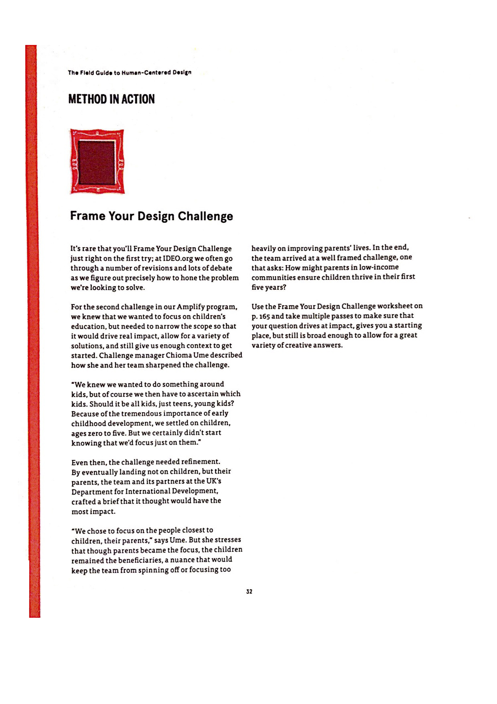
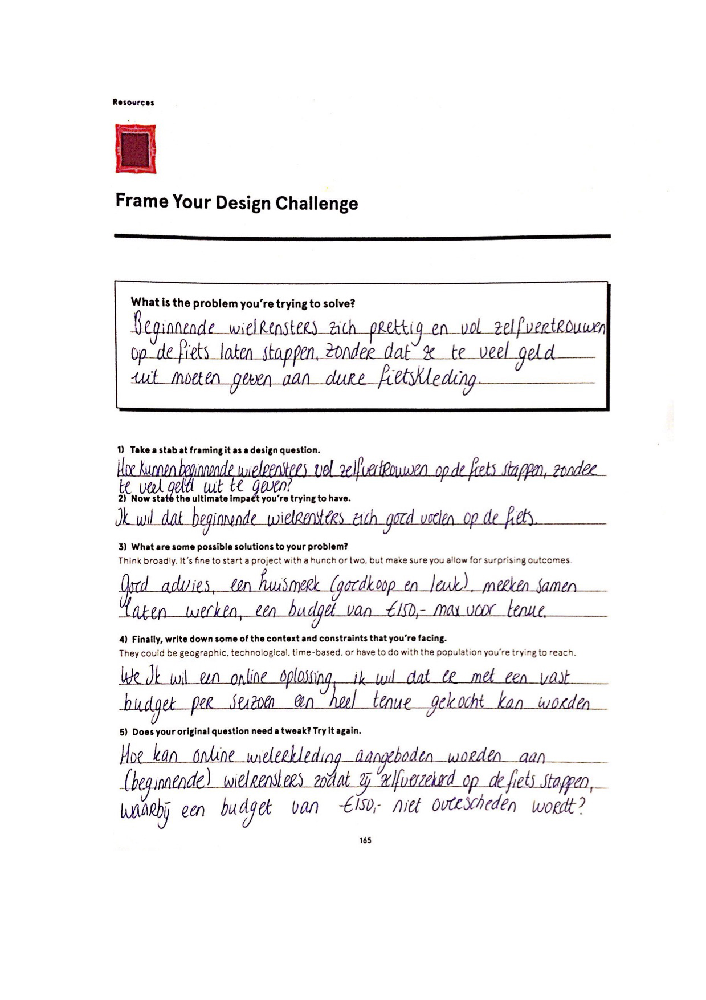
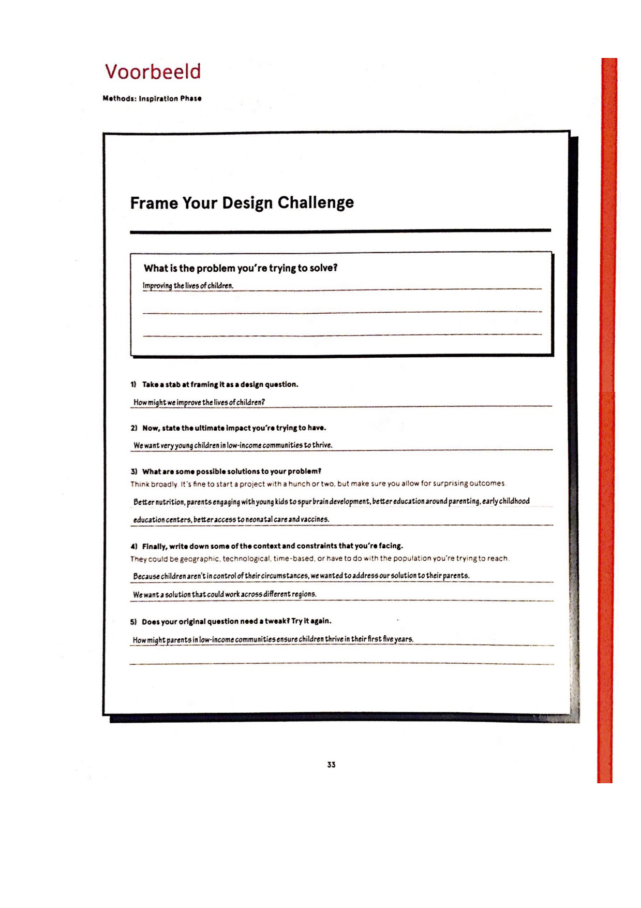

# Design Challenge



Om tot een ontwerpvraag te komen, is gebruik gemaakt van een template van “The Field Guide to Human Centered Design”.. De uitleg en uitwerking van deze methode is te vinden in bijlage 1. 

Vanuit de methode is de volgende ontwerpvraag geformuleerd:

_“Hoe kan online wielerkleding aangeboden worden aan \(beginnende\) wielrensters zodat zij geen zorgen hebben over hun wielerkleding en daardoor met meer zelfverzekerdheid op de fiets stappen, waarbij een budget van €150,- per wielerseizoen als maatstaf gehouden wordt?”_



Om de ontwerpvraag te kunnen beantwoorden, is deze opgedeeld in 6 deelvragen, zie figuur 1. Deze deelvragen kunnen beantwoord worden door middel van verschillende subvragen. Door gebruik te maken van deze subvragen, kunnen belangrijke elementen niet over het hoofd gezien worden en kan er een planning worden gemaakt. De subvragen bestaan uit vragen die gaan over verkenning, ideatie en testen van het ontwerp.




**BIJLAGE 1 WORKSHEET FRAME YOUR DESIGN CHALLENGE**




