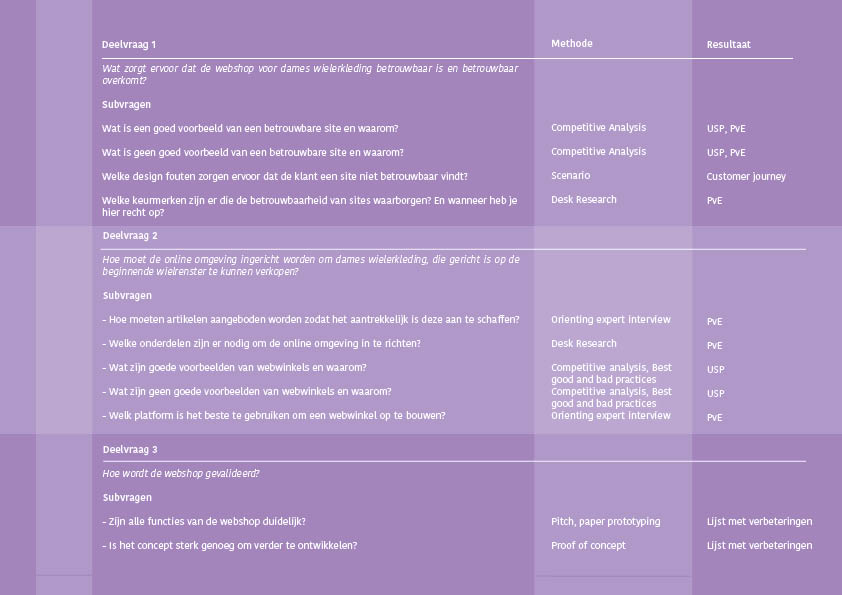
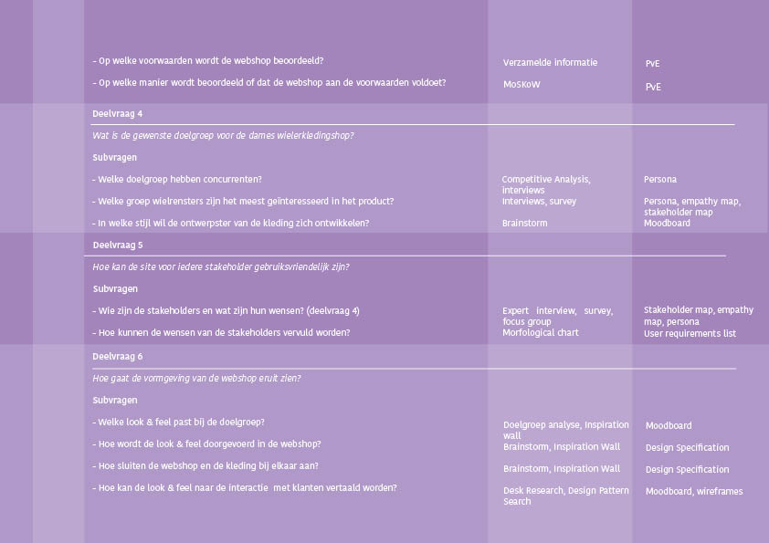

# Flow



Het project is gericht op het onderzoek en de conceptontwikkeling. In figuur 1 worden bij alle subvragen de methodes weergegeven die gebruikt worden voor het vinden van de antwoorden. Daarbij is te zien dat methodes elkaar opvolgen en informatie uit het ene onderzoek wordt gebruikt in het andere. 

In de beginfase zijn de kans en de bijbehorende stakeholders onderzocht om zo het concept aan te laten sluiten bij de doelgroep. 

Toen de doelgroep en de kans in kaart gebracht waren, is het concept uitgewerkt. Hiervoor zijn verschillende oplossingen gezocht voor de kansen die er lagen. Door middel van feedback van docenten, medestudenten en experts is de meest passende oplossing gekozen. Deze gekozen oplossing is uitgewerkt tot een paper prototype. Het prototype is gebruikt tijdens het testen van het concept en het itereren van verschillende mogelijkheden.

Nadat het hele concept getest was, ben ik gaan kijken naar de Feel van de webshop. De ontwikkeling van de Feel is het hele project lang in gang geweest, maar is in de laatste fase concreet gemaakt en omgezet in een Hifi prototype




  
CMD HvA. \(z.d.\). CMD Methods Pack - find a combination of research methods that suit your needs. Geraadpleegd op 8 april 2019, van http://cmdmethods.nl/



